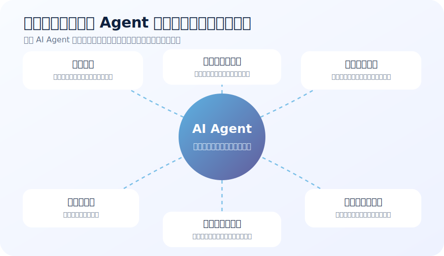
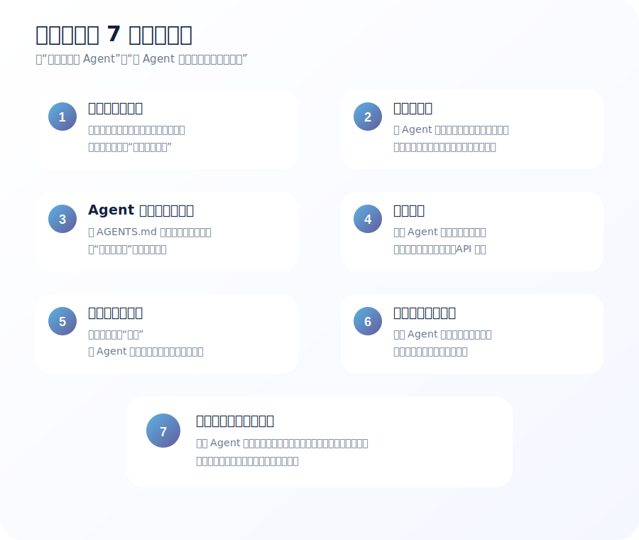
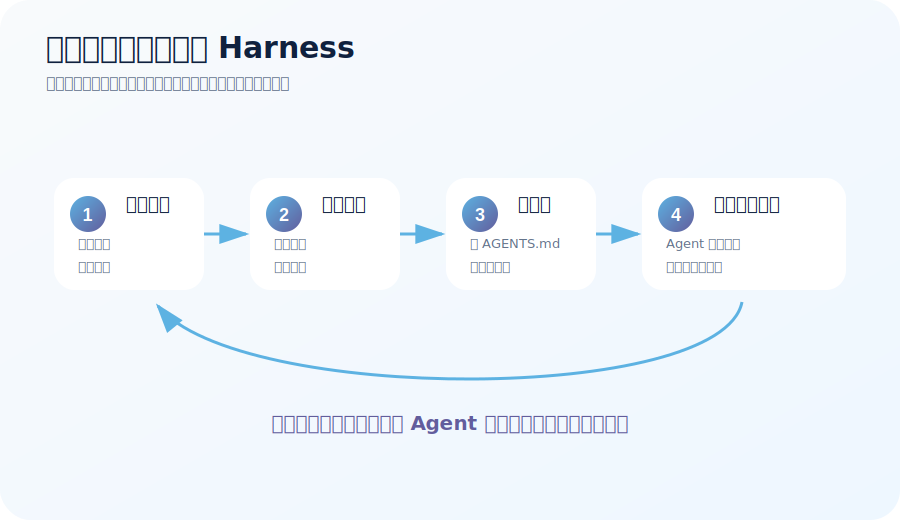
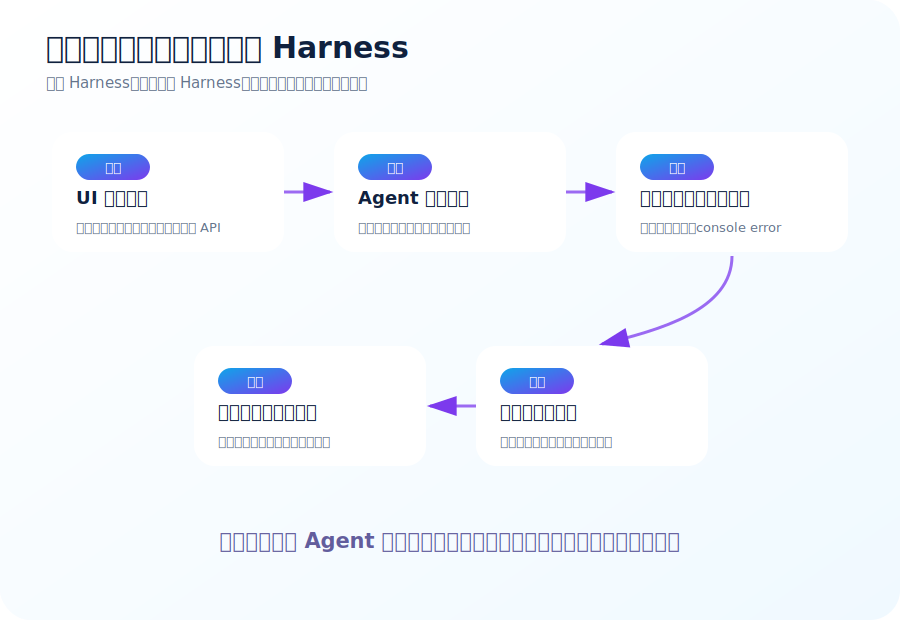

# 什么是驾驭工程：让 AI Agent 真正进入工程体系的 7 个关键部分

最近 Mitchell Hashimoto 在《My AI Adoption Journey》里提到一个很有意思的说法：**harness engineering**。

这个词直译有点别扭。

`Harness` 可以指马具、挽具、安全带，也可以指工程里的测试夹具、测试框架、工具外壳。放到 AI Agent 场景里，我更愿意把它翻译成：**驾驭工程**。

但先把边界说清楚：

> **Harness Engineering 不是行业已经定型的正式学科，也不是 Harness 这家公司产品的简称。**

Mitchell 在原文里说得很克制：他还不知道行业里有没有一个被广泛接受的名字，但他逐渐把这件事称为 `harness engineering`。

他讲的核心意思是：

> **每当你发现 Agent 犯了一个错误，就花时间做一个工程化解决方案，让它以后不再犯同类错误。**

这句话看起来简单，但其实很关键。

因为它把我们使用 AI Agent 的重心，从“怎么提示它”推到了“怎么为它设计工作环境”。



---

## 先说结论：驾驭工程到底是什么？

我给一个更完整、但仍然容易理解的定义：

> **驾驭工程，是围绕 AI Agent 搭建目标、上下文、说明、工具、验证、权限和反馈机制，让 Agent 能在真实工程环境里稳定地产出正确结果的一套工程化实践。**

如果再说得更大白话一点：

> **AI Agent 就像一个很能干的新同事。你不能只靠嘴教它，也不能每次站在旁边盯着它。你要给它工作说明、工具箱、检查表、权限边界和复盘机制。这个过程，就是驾驭工程。**

它不是在研究怎么让模型更聪明。

它研究的是：

- Agent 该知道什么
- Agent 可以做什么
- Agent 做完以后怎么验证
- Agent 失败以后怎么修正
- Agent 犯过的错怎么不再重复
- 人应该在什么环节介入
- 团队如何把这些经验沉淀成资产

所以，驾驭工程的重点不是“AI 能不能写代码”。

重点是：

> **当 AI 已经能行动之后，我们如何让它在工程体系里可靠地行动。**

---

## 为什么现在需要这个概念？

过去我们用 AI，更多是在聊天框里问问题。

比如：

- 帮我解释这段代码
- 帮我写一个函数
- 帮我看看这个报错
- 帮我生成几个测试用例

这种模式里，AI 更像顾问。

它说得对不对，最后还是人来判断；它能不能执行，最后还是人手工落地。

但现在的 Agent 已经不一样了。

Claude Code 的公开说明里，已经把自己描述成能读取代码库、编辑文件、运行命令、处理 Git 工作流的 agentic coding tool。Amp 的文章也展示过，一个很小的代码编辑 Agent，只要有 LLM、循环和几个工具，就能读文件、列目录、改文件。

这意味着：

> **Agent 不只是说话，它开始动手了。**

一旦它开始动手，问题就变了。

以前我们担心的是：

> “它回答得准不准？”

现在还要担心：

> “它动得稳不稳？改得对不对？有没有验证？能不能追踪？会不会下次还犯同样的错？”

这就是驾驭工程出现的背景。

大白话讲：

> 以前你是在问一个聪明网友。现在你是在让一个机器人进你的车间干活。车间里不能只靠一句“你小心点”。

---

## 驾驭工程和提示词工程有什么区别？

很多人看到这里，会以为驾驭工程就是写更好的 prompt。

不是。

提示词工程当然重要，但它只是其中一小部分。

| 概念 | 主要问题 | 典型产物 | 局限 |
| --- | --- | --- | --- |
| Prompt Engineering | 这次我要怎么说清楚？ | 提示词、角色设定、输出格式 | 容易停留在单次对话 |
| Context Engineering | 该给模型哪些信息？ | 文件引用、检索、摘要、知识库 | 给多了会污染，给少了会误判 |
| Tool Engineering | Agent 能调用什么能力？ | 读文件、跑测试、截图、查日志、调用 API | 工具不好用会让 Agent 误用或不用 |
| Harness Engineering | 怎样让 Agent 稳定做好事、少犯错？ | 说明、工具、验证、权限、流程、复盘机制 | 需要持续工程投入 |

最关键的区别是这句话：

> **提示词工程问：“我怎么告诉 Agent？”驾驭工程问：“我能不能做个机制，让它不用我每次都告诉？”**

举个例子。

如果 Agent 总是跑错测试命令，你可以在聊天里提醒它：

> “不要跑 `npm test`，请跑 `npm run test:component -- Button`。”

这是提示。

但驾驭工程会进一步做：

- 在 `AGENTS.md` 写清楚测试策略
- 新增 `npm run verify:component Button` 这样的封装命令
- 让命令输出更短、更结构化
- 在完成标准里要求 Agent 必须报告验证结果
- 如果再次跑错，继续补说明或改工具

这就不是一次提示，而是一套机制。

---

## 驾驭工程包含哪几个部分？

我建议把它拆成 **7 个部分** 来理解。

这 7 个部分不是某个官方标准，而是根据 Mitchell 的原文、现代 coding agent 的工作方式，以及工程团队实际落地 Agent 时常见的问题整理出来的实践框架。



它们分别是：

1. **目标与任务切分**：让 Agent 知道要做什么，也知道不做什么
2. **上下文工程**：给 Agent 正确、干净、足够少的信息
3. **Agent 指南与隐式提示**：把项目经验写成 Agent 每次都能看到的说明
4. **工具工程**：给 Agent 可以调用的真实能力
5. **验证与完成标准**：让 Agent 用证据证明做对了
6. **权限、审批与审计**：让 Agent 能干活，但不能乱动
7. **错误复盘与机制化沉淀**：把一次错误变成下次不会再犯的机制

下面逐个拆开讲。

---

## 第一部分：目标与任务切分

这是驾驭工程的起点。

很多 Agent 任务失败，不是模型不够强，而是任务本身太糊。

比如这类请求：

> “帮我重构一下这个项目。”

> “把这个页面优化一下。”

> “看看这个系统有没有问题。”

这些话人也许能靠背景知识理解，但 Agent 很容易走偏。

因为它不知道：

- 优化什么指标
- 哪些文件可以改
- 哪些行为不能破坏
- 完成标准是什么
- 是先出方案，还是直接改代码
- 是做一个小修，还是大范围重构

所以驾驭工程的第一步，是把任务切成更清晰的小块。

### 它具体做什么？

目标与任务切分主要做 5 件事：

1. **明确任务边界**：这次只做什么，不做什么
2. **区分规划和执行**：复杂任务先让 Agent 出方案，不要直接开改
3. **限定修改范围**：告诉 Agent 主要关注哪些目录、文件或模块
4. **定义交付物**：最终要 PR、报告、测试、截图，还是迁移脚本
5. **定义验收标准**：什么结果算完成，什么结果不算

### 大白话解释

> 不要对 Agent 说“把家里收拾一下”。你要说“先把厨房台面清理干净，别动冰箱里的东西，完成后拍一张照片给我看”。

这个差别非常大。

前者容易变成灾难现场。

后者才像可以执行的任务。

### 示例：把模糊任务改成清晰任务

模糊版本：

> “帮我优化订单页面。”

更适合 Agent 的版本：

> “请只优化 `OrderList` 页面首屏加载体验。先阅读当前组件和数据请求逻辑，给出一个不超过 5 条的改造计划。不要修改公共 API，不要引入新依赖。等我确认方案后，再分步实现。完成后需要跑相关组件测试，并提供桌面和移动端截图。”

这不是啰嗦。

这是在降低 Agent 犯错概率。

---

## 第二部分：上下文工程

Agent 不是读心术。

它做得好不好，很大程度取决于它看到了什么。

但上下文不是越多越好。

Amp 的上下文管理文章提醒过一个很现实的问题：上下文窗口越长，质量越容易下降；不相关内容也会影响模型输出。

所以，上下文工程不是“把所有东西塞进去”。

它的核心是：

> **给对信息，而不是给满信息。**

### 它具体做什么？

上下文工程主要处理 6 类信息：

1. **代码上下文**：相关文件、模块结构、调用链
2. **业务上下文**：这个功能解决什么业务问题
3. **架构上下文**：服务边界、依赖关系、技术栈约束
4. **历史上下文**：过去为什么这样设计，哪些坑踩过
5. **运行上下文**：日志、测试失败、环境变量、部署状态
6. **规范上下文**：代码风格、命名规则、安全要求、发布流程

好的上下文应该有三个特点：

- **相关**：和当前任务有关
- **准确**：不是过期资料，不是猜测
- **简洁**：能少给就少给，能结构化就结构化

### 大白话解释

> Agent 像一个外包工程师。你不能只给它一句“修一下”，也不能把公司十年文档全发过去。你要把和这次活最相关的资料整理出来。

### 示例：CI 失败排查

差的上下文：

> “CI 挂了，帮我看看。”

然后贴 5 万行日志。

好的上下文：

- 当前失败的 job 名称
- 最近一次相关 commit
- 失败测试名称
- 核心错误堆栈
- 本地复现命令
- 相关模块路径
- 过去是否有类似失败

这时 Agent 才有机会做出高质量判断。

---

## 第三部分：Agent 指南与隐式提示

Mitchell 原文里提到的第一种 harness，就是更好的隐式提示，比如 `AGENTS.md`。

这类文件的价值在于：

> **把你每次都想提醒 Agent 的话，写成它每次进入项目都会看到的工作说明。**

它不是普通 README。

README 通常是给人看的，讲项目是什么、怎么启动、怎么贡献。

Agent 指南更像“给 AI 同事的工位说明”。

### 它具体做什么？

Agent 指南适合写这些内容：

1. **项目结构**：哪些目录负责什么
2. **常用命令**：构建、测试、检查、截图怎么跑
3. **禁止事项**：哪些文件不能改，哪些命令不要跑
4. **技术约束**：不要新增依赖，不要改公共 API，不要绕过类型检查
5. **模块规则**：某个子系统的特殊约定
6. **验证方式**：不同类型任务应该跑什么验证
7. **常见坑**：Agent 或新人容易踩的坑
8. **输出要求**：完成后必须说明哪些验证和风险

Mitchell 引用过 Ghostty 项目的一个 `AGENTS.md` 示例。它很短，但很有代表性：说明 Inspector 子系统类似浏览器开发者工具；查 C API 要在 `.zig-cache` 里找 `dcimgui.h`；macOS 上验证 API 用法要带特定编译参数；这个包没有单元测试。

注意，它没有写成长篇论文。

它只是把关键坑点写清楚。

### 大白话解释

> 这就像你给新同事贴在显示器旁边的便签：这个项目别跑全量测试，太慢；这个模块没有单测，要用这个命令编译验证；这个 API 已经废弃，不要再用。

### 一个简化版 Agent 指南示例

```md
# AGENTS.md

## 当前模块
这是订单列表页面，主要代码在 `src/features/orders`。

## 修改原则
- 不要修改公共组件 API，除非用户明确要求。
- 不要新增 UI 依赖，优先使用现有设计系统。
- 不要直接改自动生成文件。

## 验证命令
- 组件改动：`npm run test:component -- OrderList`
- 类型检查：`npm run typecheck`
- UI 改动：`npm run screenshot -- /orders`

## 完成要求
最终回复必须包含：修改文件、验证命令、截图路径、未验证项。
```

这个文件不复杂，但能明显减少 Agent 反复犯低级错误。

---

## 第四部分：工具工程

只给说明还不够。

因为 Agent 最大的问题往往不是“不知道”，而是“没法快速确认自己对不对”。

Mitchell 原文里提到的第二种 harness，就是真实可运行的工具。

### 它具体做什么？

工具工程要给 Agent 提供可调用、可理解、可反馈的能力。

常见工具包括：

| 工具类型 | 做什么 | 对 Agent 的价值 |
| --- | --- | --- |
| 相关测试工具 | 只跑和当前变更相关的测试 | 快速知道改动有没有破坏功能 |
| 日志摘要工具 | 从长日志里提取关键错误 | 避免 Agent 被噪音淹没 |
| 截图工具 | 打开页面并生成截图 | 让 UI 改动可见、可比较 |
| 类型检查工具 | 检查 TypeScript/Java/Go 类型错误 | 快速发现静态错误 |
| API 校验工具 | 检查 OpenAPI、GraphQL、兼容性 | 避免接口变更破坏客户端 |
| 配置校验工具 | 检查 Kubernetes、Helm、Terraform 配置 | 提前发现部署问题 |
| PR 摘要工具 | 汇总 diff、风险、验证结果 | 帮助人更快 review |

一个好工具，要满足四个条件：

1. **容易调用**：命令短，参数清楚
2. **反馈快**：尽量秒级或分钟级，不要动不动半小时
3. **输出短**：失败原因清楚，不要海量日志
4. **适合 Agent 阅读**：结构化、少噪音、重点突出

### 大白话解释

> 你不能让 Agent 拿着螺丝刀去拧所有东西。你要给它合适的工具，还要在工具上贴标签：这个用来测组件，这个用来截图，这个用来看失败原因。

### 示例：把长日志变成 Agent 能读的摘要

差的做法：

- CI 失败后，把完整日志扔给 Agent
- Agent 在几万行文本里找错误
- 容易漏掉重点，也浪费上下文

更好的做法：

- 写一个 `ci:summarize-failure` 工具
- 输出失败 job、失败测试、核心堆栈、相关文件
- 最后附上本地复现命令

输出可以像这样：

```text
失败 job: frontend-component-test
失败测试: OrderList renders empty state
相关文件: src/features/orders/OrderList.tsx
核心错误: expected "暂无订单" but received "No orders"
建议复现: npm run test:component -- OrderList
```

这比 5 万行日志有用得多。

---

## 第五部分：验证与完成标准

很多 Agent 的问题不是做不出来，而是太早宣布完成。

它可能会说：

> “我已经完成修改。”

但实际上：

- 测试没跑
- 类型检查没跑
- UI 没截图
- API schema 没更新
- 数据库迁移没验证
- 只是代码看起来合理

工程里，“看起来合理”不等于“正确”。

所以驾驭工程必须定义验证和完成标准。

### 它具体做什么？

验证与完成标准主要包括：

1. **任务类型对应验证**
   - 改组件：组件测试 + 截图
   - 改 API：接口测试 + schema 检查
   - 改数据库：迁移 dry-run + 回滚方案
   - 改部署配置：manifest 校验 + staging 验证

2. **完成报告格式**
   - 修改了哪些文件
   - 跑了哪些命令
   - 命令结果是什么
   - 哪些没有验证
   - 有哪些风险

3. **失败后的处理规则**
   - 验证失败先分析原因
   - 能修就修
   - 不能修就报告阻塞点
   - 不要假装通过

### 大白话解释

> 你不能只听 Agent 说“我觉得行”。你要让它拿小票：跑了什么、结果是什么、哪里没验、风险在哪。

### 示例：完成标准清单

一个比较实用的完成标准可以这样写：

```md
完成前必须检查：

- [ ] 是否只修改了任务范围内文件？
- [ ] 是否运行了相关测试？
- [ ] 是否运行了类型检查或编译？
- [ ] UI 变更是否提供截图？
- [ ] API 变更是否更新 schema？
- [ ] 是否说明未验证项和风险？
```

这类清单看起来朴素，但非常有效。

因为它把“完成”从一句口头声明，变成了可检查的证据。

---

## 第六部分：权限、审批与审计

当 Agent 只是回答问题时，权限问题不明显。

当 Agent 能修改文件、跑命令、发 PR、调 API、操作环境时，权限就非常关键。

尤其在企业场景里，不能只靠一句：

> “你别乱动。”

### 它具体做什么？

权限、审批与审计主要解决 5 个问题：

1. **Agent 能看什么**
   - 能否访问代码库
   - 能否读取日志
   - 能否查看生产数据

2. **Agent 能改什么**
   - 是否只能改工作区文件
   - 是否能改配置
   - 是否能改数据库迁移

3. **Agent 能调用什么工具**
   - 哪些命令允许运行
   - 哪些 API 可以调用
   - 哪些工具需要人工确认

4. **哪些动作需要审批**
   - 发 PR 可以自动
   - 合并 PR 要人工
   - 生产部署要审批
   - 删除资源必须禁止或强审批

5. **做过什么能不能追踪**
   - 调用了哪些工具
   - 修改了哪些文件
   - 使用了哪些输入
   - 产出了什么结果

Harness Agents 这类平台化产品强调 RBAC、OPA、审计日志、可见工件，本质上也是在解决这层问题。

### 大白话解释

> 你可以让新同事干活，但不会第一天就给他生产数据库删除权限。Agent 也一样。能干活，不等于能乱动。

### 一个简单的权限分层

| 风险等级 | Agent 可以做什么 | 是否需要人确认 |
| --- | --- | --- |
| 低风险 | 读文件、跑测试、生成报告 | 通常不需要 |
| 中风险 | 修改代码、生成 PR、更新文档 | 需要 review |
| 高风险 | 改 CI/CD 配置、改数据库迁移 | 需要明确审批 |
| 极高风险 | 生产部署、删除资源、访问敏感数据 | 默认禁止或强审批 |

这不是限制 Agent 的价值。

这是让 Agent 的价值可持续。

---

## 第七部分：错误复盘与机制化沉淀

这是 Mitchell 最强调的一点。

Agent 犯错本身不可怕。

真正浪费时间的是：同一个错反复犯。

比如：

- 每次都跑错命令
- 每次都忘记截图
- 每次都改自动生成文件
- 每次都用废弃 API
- 每次都说测试通过，但其实没跑

如果每次都靠人提醒，那人就成了 Agent 的外置记忆。

驾驭工程要做的是：

> **把人的重复提醒，变成系统的长期机制。**



### 它具体做什么？

每次 Agent 犯错后，可以按这个流程处理：

1. **记录错误**
   - 错在哪里
   - 影响是什么
   - 是偶发错误，还是重复模式

2. **分析原因**
   - 缺上下文？
   - 缺说明？
   - 缺工具？
   - 验证太慢？
   - 权限边界不清？
   - 完成标准不明确？

3. **补一个最小机制**
   - 加一行 `AGENTS.md`
   - 加一个脚本
   - 改一个命令输出
   - 加一条 PR checklist
   - 加一个工具说明

4. **观察是否复发**
   - 下次同类任务是否还犯
   - 如果还犯，继续补 harness

### 大白话解释

> 不要只说“你怎么又错了”。要问：“我应该在哪贴一张纸、加一个按钮、装一个护栏，让它下次没机会这样错？”

这就是驾驭工程最有价值的地方。

它让每一次错误都变成系统升级的机会。

---

## 一个完整示例：前端页面改版怎么做驾驭工程

假设你经常让 Agent 改前端页面。

没有 harness 时，任务可能是这样：

> “帮我把订单页面改得现代一点。”

Agent 可能会：

- 随便改视觉风格
- 引入一个新 UI 库
- 破坏移动端布局
- 改了公共组件 API
- 没有截图
- 没有检查控制台错误
- 没有跑相关测试

这不是 Agent 一定笨。

是你没有给它工作环境。



### 有 harness 后，可以这样做

#### 1）任务边界

告诉 Agent：

- 只改 `OrderList` 页面
- 不改公共组件 API
- 不新增依赖
- 保持移动端适配
- 先给方案，再实现

#### 2）上下文

提供：

- 当前页面组件
- 设计系统文档
- 现有列表页样式示例
- 当前路由
- 已知问题截图

#### 3）Agent 指南

在 `AGENTS.md` 写：

- UI 改动必须使用现有设计 token
- 不允许新增 UI 库
- 改动后必须截图桌面端和移动端
- 完成回复必须附截图路径

#### 4）工具

提供几个命令：

- `npm run test:component -- OrderList`
- `npm run typecheck`
- `npm run screenshot -- /orders`
- `npm run console-check -- /orders`

#### 5）验证

要求最终报告：

- 改了哪些文件
- 跑了哪些验证
- 截图在哪里
- console 是否有报错
- 移动端是否验证

#### 6）权限

限制：

- 不允许改设计系统底层 token
- 不允许改公共组件 API
- 不允许新增依赖
- PR 必须人工 review

#### 7）复盘

如果 Agent 还是忘记移动端截图，就补一条机制：

- 修改截图脚本，默认同时截桌面和移动端
- 在完成标准里加“缺移动端截图则任务未完成”

你看，这样一来，Agent 就不是在黑屋里改页面。

它有灯，有尺，有检查表，也有交付模板。

---

## 再举一个后端例子：API 改动怎么做驾驭工程

后端 API 改动也很适合说明这个概念。

假设你让 Agent 改一个订单查询接口。

没有 harness 时，它可能会：

- 改了返回字段，但没更新 OpenAPI
- 改了数据库查询，但没考虑索引
- 单测通过，但集成测试失败
- 改了字段含义，但没考虑老客户端兼容
- 没有说明破坏性变更

有 harness 后，可以这样做。

### 1）任务边界

明确告诉 Agent：

- 只新增字段，不删除旧字段
- 保持老客户端兼容
- 不改认证逻辑
- 不改数据库表结构，除非先给迁移方案

### 2）上下文

提供：

- 当前 API handler
- DTO / schema 定义
- OpenAPI 文件
- 相关测试
- 客户端调用示例

### 3）工具

提供：

- `npm run test:api -- orders`
- `npm run check:openapi`
- `npm run check:api-compat`
- `npm run db:migration:dry-run`

### 4）完成标准

要求 Agent 最终说明：

- 是否更新 OpenAPI
- 是否通过兼容性检查
- 是否新增或修改测试
- 是否有数据库影响
- 是否存在客户端迁移风险

这样，Agent 做 API 改动时，就不只是“把代码改到能跑”。

它会被引导去考虑工程里真正重要的东西：兼容性、契约、测试和风险。

---

## 再举一个 CI 失败例子：从救火到机制化

CI 失败是 Agent 很适合处理的场景。

但前提是你给它足够好的 harness。

### 没有 harness 的情况

你对 Agent 说：

> “CI 挂了，帮我修一下。”

Agent 可能会：

- 看错失败 job
- 被无关日志带偏
- 修了表面错误
- 没有本地复现
- 没有跑相关测试
- 最后说“应该修好了”

### 有 harness 的情况

你给它：

- CI 失败摘要工具
- 本地复现命令
- 相关测试命令
- 最近变更列表
- 禁止绕过测试的规则
- 完成报告模板

Agent 的流程就会更像这样：

1. 读取失败摘要
2. 找到失败测试和相关文件
3. 本地复现
4. 修改最小代码
5. 重跑相关测试
6. 如果失败继续迭代
7. 最终提交修复说明和验证结果

这才是从“让 AI 猜一猜”变成“让 Agent 进入工程闭环”。

---

## 驾驭工程的三个成熟度层级

为了更容易落地，可以把团队的驾驭工程能力分成三个层级。

### 第一层：个人级 Harness

这是个人开发者最容易开始的层级。

典型做法：

- 给项目写一个简短 `AGENTS.md`
- 把常用测试命令写清楚
- 让 Agent 完成后报告验证结果
- 遇到重复错误就补一条说明

这一层不复杂，但立刻有效。

### 第二层：项目级 Harness

这是团队协作时更重要的层级。

典型做法：

- 统一项目 Agent 指南
- 封装 `verify:changed`、`test:related` 等命令
- 为 UI、API、数据库、部署配置分别建立验证流程
- PR 模板要求说明 Agent 使用和验证证据
- 把常见错误变成 checklist 或脚本

这一层会让 Agent 使用从“个人技巧”变成“团队能力”。

### 第三层：组织级 Harness

这是企业采用 Agent 时真正困难、也最有价值的层级。

典型做法：

- 统一 Agent 权限模型
- 统一审计记录
- 统一工具注册和 allowlist
- 建立 Agent 可执行任务目录
- 把高频任务沉淀成模板
- 与 CI/CD、代码仓库、工单系统、发布系统打通

Harness Agents 这类平台级产品，其实就是在往这一层靠。

---

## 常见误区：别把驾驭工程做反了

### 误区一：把 AGENTS.md 写成百科全书

Agent 指南不是越长越好。

太长会稀释重点，也会污染上下文。

更好的方式是：短、准、贴近错误模式。

### 误区二：只加说明，不加工具

如果没有工具，Agent 还是只能靠猜。

说明告诉它该做什么。

工具让它能验证自己有没有做对。

### 误区三：只追求自动化，不设计权限

Agent 能力越强，越要有边界。

否则短期很爽，长期很危险。

### 误区四：让 Agent 做所有事

不是所有任务都适合 Agent。

适合 Agent 的任务通常有几个特点：

- 边界清楚
- 可验证
- 上下文可获得
- 错误可回滚
- 人可以 review

高度模糊、高风险、强业务判断的任务，应该先让 Agent 辅助分析，而不是直接执行。

### 误区五：Agent 犯错后只改 prompt

有些错误确实可以靠 prompt 修。

但如果同类错误反复出现，就应该问：

- 是不是缺一条项目规则？
- 是不是缺一个验证脚本？
- 是不是工具输出太乱？
- 是不是权限边界不清？
- 是不是任务拆得太大？

这才是驾驭工程的思维。

---

## 一个团队可以怎么开始？

不用一上来做平台。

可以从一个很小的循环开始。

### 第一天：写一个最小 Agent 指南

只写四类内容：

- 项目结构
- 常用命令
- 禁止事项
- 完成标准

不要超过一页。

### 第二天：封装一个最快验证命令

比如：

- `npm run verify:changed`
- `make test-related`
- `pnpm check:fast`

目标不是覆盖一切，而是让 Agent 有一个优先使用的验证入口。

### 第三天：整理一个失败日志摘要工具

把最常见的 CI 失败日志压缩成：

- 失败 job
- 失败测试
- 核心错误
- 相关文件
- 复现命令

### 第四天：定义完成报告模板

要求 Agent 最终输出：

- 修改内容
- 验证命令
- 验证结果
- 未验证项
- 风险点

### 第五天：复盘一次 Agent 失败

找一次真实失败，不要只改代码。

问：

> 这次错误能不能变成一条说明、一个脚本、一个检查项或一个权限限制？

如果能，就补进去。

这就是起步。

---

## 怎么判断驾驭工程做得好不好？

可以用 10 个问题自查。

1. Agent 第一次进入项目时，能否知道正确验证命令？
2. 项目里是否有给 Agent 看的说明文件？
3. 说明文件是否短、准、贴近常见错误？
4. Agent 是否能快速运行相关测试，而不是盲目跑全量？
5. 日志和错误输出是否适合 Agent 阅读？
6. UI 任务是否有截图和控制台检查机制？
7. API 任务是否有 schema 和兼容性检查？
8. Agent 能改什么、不能改什么，是否有边界？
9. Agent 完成任务时，是否必须提供验证证据？
10. Agent 犯错后，团队是否会把错误沉淀成机制？

如果这些问题大多回答“不确定”，说明团队还处在“会用 Agent”的阶段。

如果大多回答“是”，才开始进入“会驾驭 Agent”的阶段。

---

## 最后再回到 Mitchell 的原意

Mitchell 讲 harness engineering，不是在创造一个酷词。

他真正强调的是一个非常工程化的态度：

> **看到 Agent 犯错，不只是纠正这一次，而是补一个机制，让它以后少犯同类错误。**

这和优秀工程团队平时做质量改进，其实是一脉相承的。

过去我们会做：

- 单元测试
- CI 检查
- 静态分析
- 代码规范
- Review checklist
- 事故复盘
- 自动化脚本

现在 Agent 加入工程体系后，我们要把这些思路延伸到 Agent 身上。

不是为了神化 Agent。

恰恰相反，是因为我们知道它会犯错，所以才要给它 harness。

大白话收束一下：

> **不要把 Agent 当神，也不要把 Agent 当傻子。把它当一个有能力但需要工程环境的新同事。你给它的环境越清楚、工具越顺手、反馈越快、边界越明确，它就越能稳定地产出价值。**

这就是驾驭工程。

未来真正拉开差距的，可能不只是“谁用了更强的模型”，而是：

> **谁更会为 Agent 设计工作环境。**

---

## 一页版总结

- **驾驭工程是什么**：围绕 AI Agent 搭建目标、上下文、说明、工具、验证、权限和复盘机制，让它在真实工程环境里稳定工作。
- **它不是什么**：不是单纯提示词工程，不是 Harness 公司产品简称，也不是已经定型的官方学科。
- **核心原则**：Agent 每犯一次错，都要想办法把它变成下次不会再犯的机制。
- **7 个组成部分**：目标与任务切分、上下文工程、Agent 指南、工具工程、验证标准、权限治理、错误复盘。
- **大白话理解**：给 AI 新同事配 SOP、工具箱、检查表、权限边界和复盘机制。
- **最小起步**：写一个短 `AGENTS.md`，封装一个快速验证命令，要求 Agent 提供验证证据。
- **最终价值**：把 Agent 从“临时帮手”变成“在可控环境里工作的工程成员”。

---

## 参考资料

以下内容整理自公开资料，时间截至 2026-05-26：

- Mitchell Hashimoto《My AI Adoption Journey》：
  - https://mitchellh.com/writing/my-ai-adoption-journey#step-5-engineer-the-harness
- Ghostty Inspector 子系统 `AGENTS.md` 示例：
  - https://github.com/ghostty-org/ghostty/blob/ca07f8c3f775fe437d46722db80a755c2b6e6399/src/inspector/AGENTS.md
- Claude Code 官方说明：
  - https://github.com/anthropics/claude-code
  - https://code.claude.com/docs/en/overview
- Amp 关于 Agent 构建与上下文管理的公开文章：
  - https://ampcode.com/how-to-build-an-agent
  - https://ampcode.com/guides/context-management
  - https://ampcode.com/news/deep-mode
- Anthropic 关于 AI 编码辅助与技能形成的研究：
  - https://www.anthropic.com/research/AI-assistance-coding-skills

---

## 适合公众号封面的备选标题

1. **什么是驾驭工程：AI Agent 真正落地前，缺的不是模型而是 Harness**
2. **别再只写 Prompt 了，AI Agent 需要的是驾驭工程**
3. **让 AI Agent 少犯错：一文讲透 Harness Engineering**
4. **AI Agent 像新同事，驾驭工程就是给它 SOP、工具箱和检查表**
5. **从会用 Agent 到会驾驭 Agent：工程团队的新基本功**
