# Skills 实践指南：从概念、结构到工作流落地

在使用 Claude、GitHub Copilot 或 VS Code Agent 的过程中，Skills 是一个非常值得重视的能力层。

很多人会把 Skill 理解成“更复杂一点的 Prompt”，这种理解有一定合理性，但并不足以解释它在真实工作流中的价值。更准确地说，Skill 是把一类任务的处理方式进行结构化封装，让智能体在相似场景中能够更稳定地复用这套方法。

从这个角度看，Skill 的核心意义并不在于“提示词更长”，而在于它把经验从一次性表达升级成了可持续复用的工作机制。

---

## 一、什么是 Skill？

可以把 Skill 理解为一个面向特定任务场景的能力包。它通常包含：

- 适用场景说明
- 执行步骤与约束
- 输出格式定义
- 可选的脚本、模板与参考资料

因此，Skill 不只是“告诉 AI 做什么”，而是在定义“遇到这类任务时，应该怎样做”。

这也是 Skill 与普通 Prompt 最关键的区别。

---

## 二、Prompt、Skill、Agent 的关系

为了更清晰地理解 Skills，建议把这三个概念区分开：

### 1）Prompt

Prompt 是用户当前提出的即时需求，例如：

```text
帮我优化这段代码。
```

### 2）Skill

Skill 是处理某类任务的方法论与规则集合，例如：

- 审查代码时需要考虑哪些维度
- 生成页面时需要遵循何种风格方向
- 输出报告时需要采用什么结构

### 3）Agent

Agent 是具体执行任务的智能体。它会结合上下文、用户目标和当前环境，在合适的时机调用对应 Skill。

因此可以简要概括为：

> Prompt 描述当前任务，Skill 定义处理方法，Agent 负责执行与协调。

---

## 三、为什么 Skill 的价值高于临时 Prompt？

临时 Prompt 的优势在于灵活，但缺点也很明显：

- 每次都要重新描述任务
- 输出风格容易不稳定
- 经验难以沉淀
- 团队难以复用

Skill 的意义在于把这些问题系统化地解决掉。

例如，在代码审查、前端页面生成、测试生成、文档写作、数据清洗等高频场景中，用户往往会反复说明相同的要求。如果这些要求始终停留在口头描述层面，那么每次都需要重新沟通。

而当这些规则被写成 Skill 之后，AI 的输出通常会更稳定，协作成本也会明显下降。

---

## 四、在 VS Code 中启用 Skills

如果要在 VS Code 中使用 Agent 与 Skills，一般需要先启用对应功能。

### 1）启用 `Use Agent Skills`

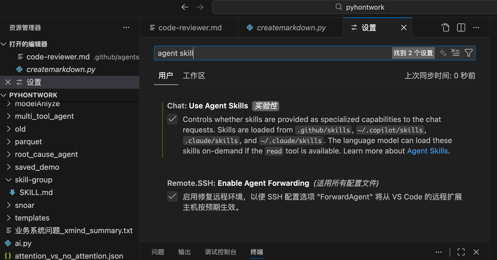

### 2）准备智能体环境

实际操作中，不同版本的 VS Code、Copilot Chat 或 Claude Code，界面名称可能略有区别，但整体逻辑通常一致：

- 先启用 Agent 能力
- 再配置好可用环境
- 最后让 Agent 能读取并使用 Skills

相关界面示意如下：

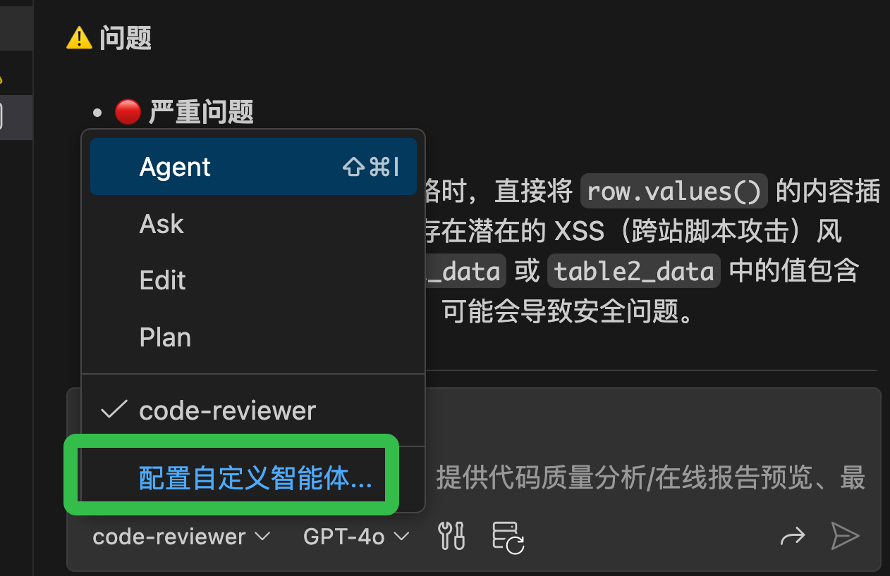

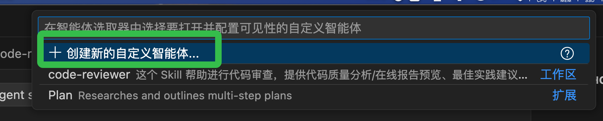

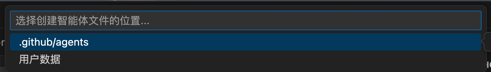

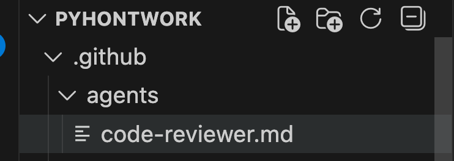

---

## 五、一个 Skill 的基本结构

一个 Skill 通常是一个目录，而最关键的文件是 `SKILL.md`。

典型结构如下：

```text
my-skill/
├── SKILL.md        # 必需：元数据 + 说明文档
├── scripts/        # 可选：脚本
├── references/     # 可选：参考资料
└── assets/         # 可选：模板、资源文件
```

这种结构的优势在于：

- 文档与执行逻辑可以放在一起
- 便于版本管理
- 便于跨项目复用
- 便于个人或团队共享

---

## 六、`SKILL.md` 为什么是核心？

`SKILL.md` 通常至少包含两部分：

### 1）YAML 元数据

```yaml
---
name: pdf-processing
description: Extract text and tables from PDF files, fill forms, merge documents.
---
```

其中：

- `name` 用于标识 Skill
- `description` 用于说明适用场景和触发条件

### 2）Markdown 正文

正文部分通常用于定义：

- 适用范围
- 处理流程
- 输出要求
- 工具或资源使用方式

一个高质量的 `SKILL.md`，应该能够让阅读者快速理解这个 Skill 的能力边界与执行方式。

---

## 七、为什么代码审查是很好的 Skill 示例？

代码审查场景天然适合 Skill 化，因为它有明确的目标、步骤和输出结构。

一个典型的代码审查 Skill，通常会定义：

- 输入范围
- 关注维度（代码质量、安全性、性能、可维护性）
- 问题分级方式
- 输出格式

例如：

```yaml
---
name: code-reviewer
description: 用于代码审查、质量分析、风险识别和报告生成。
---
```

当这类规则被固定下来后，AI 的代码审查结果通常会明显更一致，也更接近真实工作场景中的交付要求。

---

## 八、从测试结果可以看到什么？

下面两张图展示了 Skill 在实际任务中的效果：

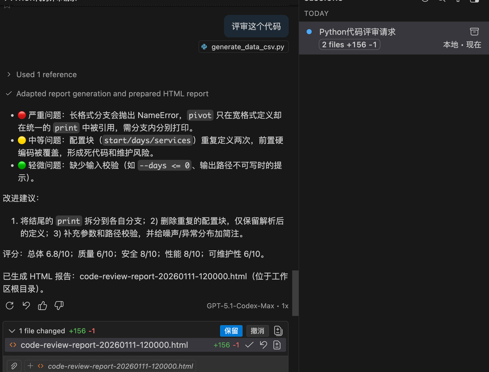

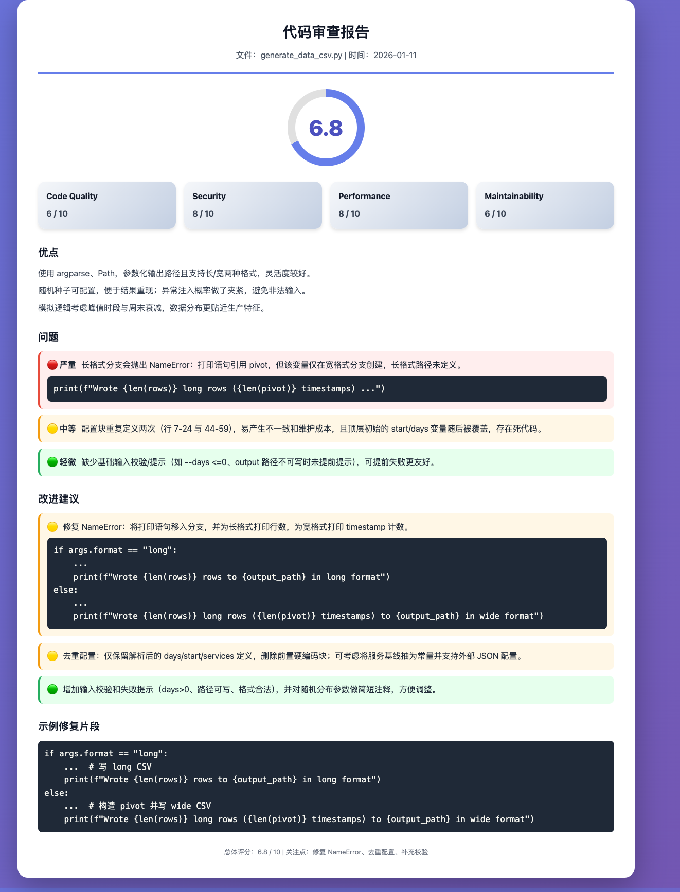

这类结果的价值，不只是“功能可用”，更重要的是它反映出一件事：

> Skill 能提升 AI 输出的一致性、稳定性和可预期性。

在很多场景里，模型能力不是主要瓶颈，真正的问题是需求表达和输出标准没有被固定下来。Skill 的作用，就是为这部分提供结构。

---

## 九、安装与管理 Skills

在实际环境中，你可能会看到不同的安装方式，例如 `openskills` 与 `npx skills`。由于工具链迭代较快，建议优先以当前环境对应的官方文档为准。

### 1）一种常见安装方式

```bash
npm i -g openskills
cd skill-group
openskills install anthropics/skills
```

相关界面：

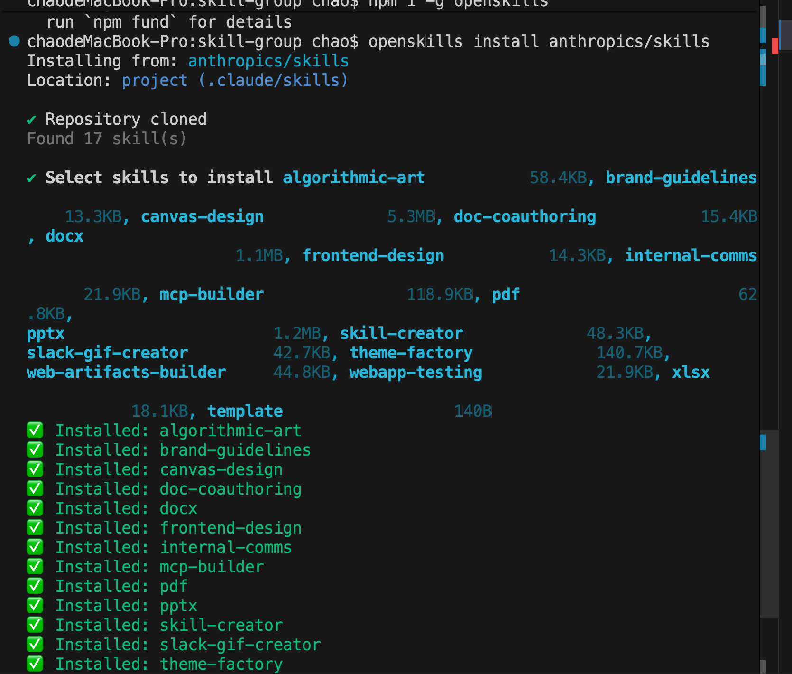

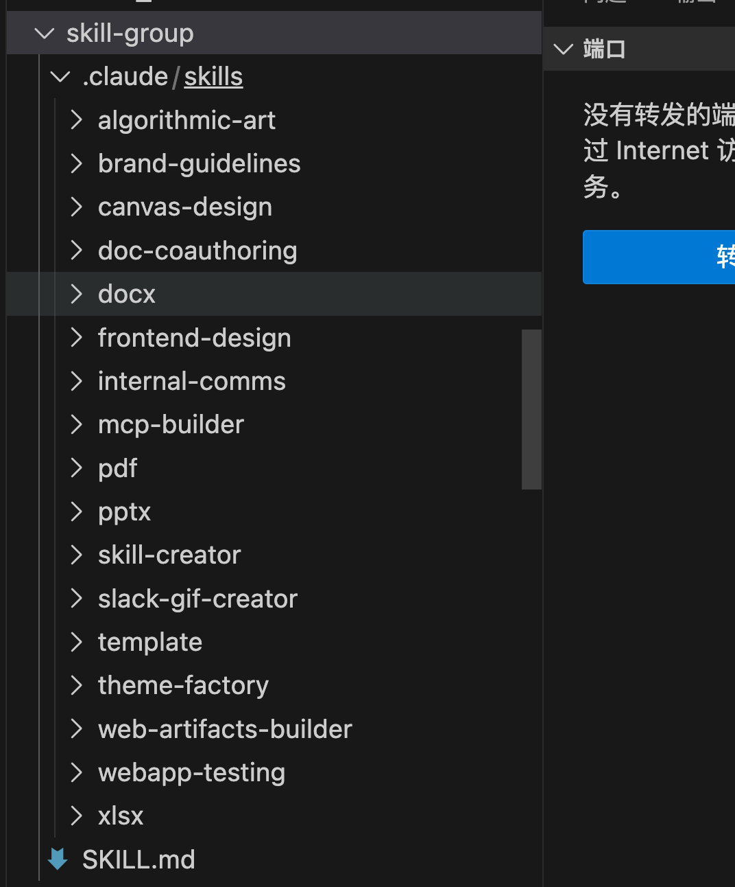

### 2）同步技能目录

```bash
openskills sync
```

这通常用于生成或同步技能目录，例如 `agents.md`。

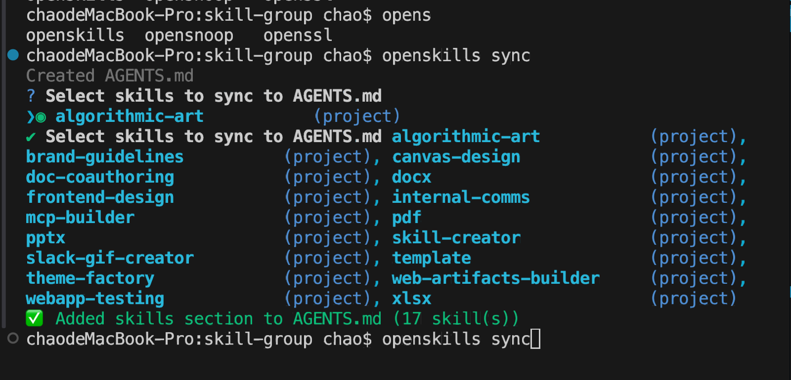

### 3）较新的 Skills CLI 常见命令

```bash
npx skills find react
npx skills add <包名或仓库地址>
npx skills check
npx skills update
```

从使用角度看，更重要的不是记住某一条命令，而是理解 Skills 可以被搜索、安装、更新和长期维护。

---

## 十、什么场景最适合用 Skill？

来看一个典型场景：

```text
根据 .claude/skills/frontend-design 的 skill，
生成一个贪吃蛇的前端页面游戏，要足够炫酷高大上，功能齐全。
```

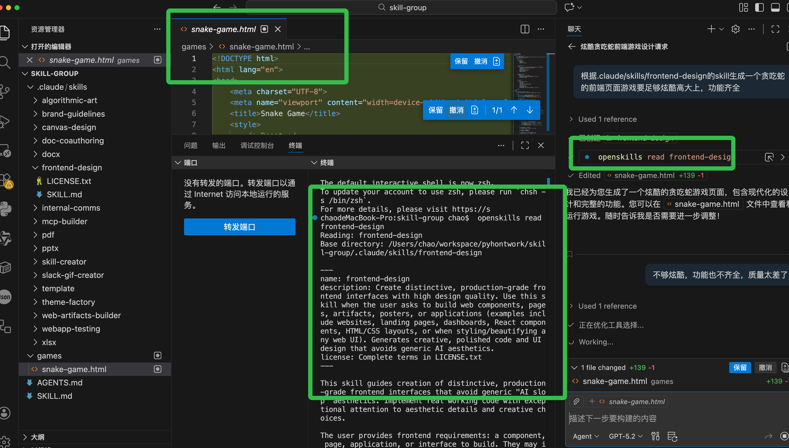

这类任务的共同特点是：

- 不只是要“能完成”
- 还要求较强的风格一致性
- 对完成度和质量有要求
- 需要较明确的输出标准

当任务对质量、风格和一致性有更高要求时，Skill 的收益通常会更明显。

---

## 十一、为什么 `skill-creator` 很关键？

如果说安装别人做好的 Skill 是在使用生态，那么 `skill-creator` 的意义就在于：它允许你把自己的经验沉淀成可复用的 Skill。

### 1）安装示例

```bash
npx skills add https://github.com/anthropics/skills --skill skill-creator
```

相关界面：

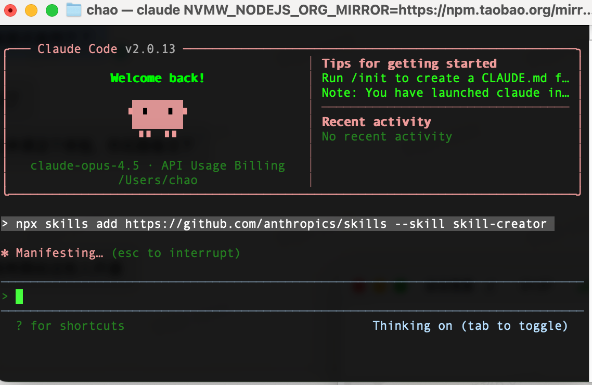

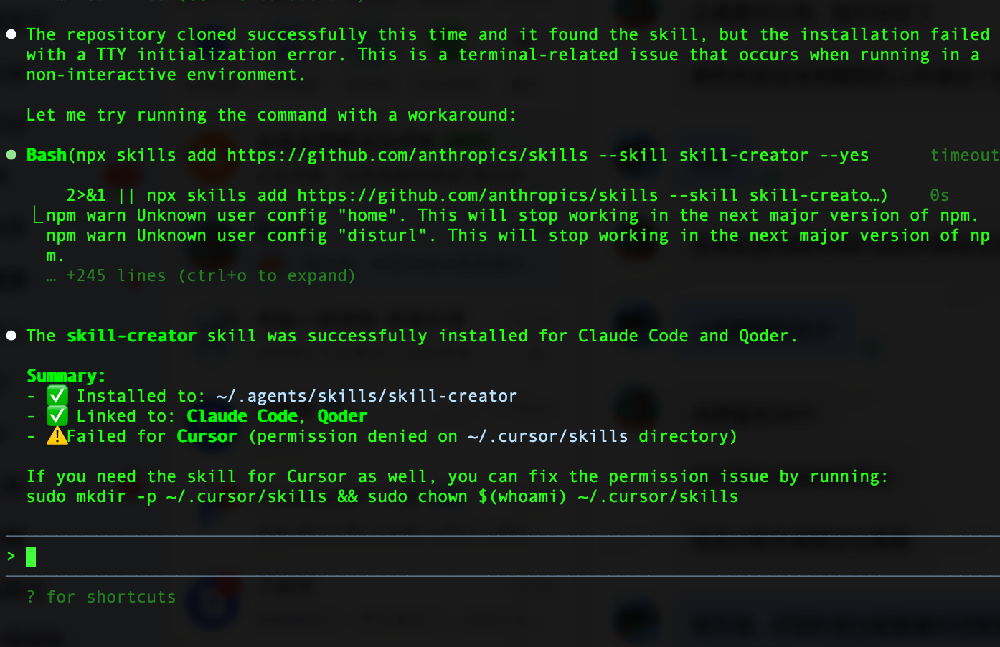

### 2）创建新 Skill 的表达方式

```text
使用 skill-creator 帮我创建一个新的 Claude Skill。
目标是：写清楚我想让这个 Skill 解决什么问题。
```

例如：

```text
使用 skill-creator 帮我创建一个新的 Claude Skill。
目标是：使用 Three.js 通过手势控制网页上的内容。
```

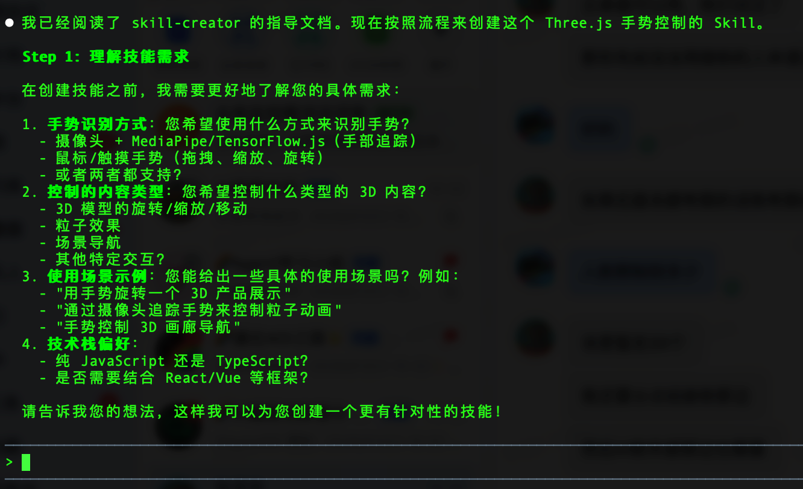

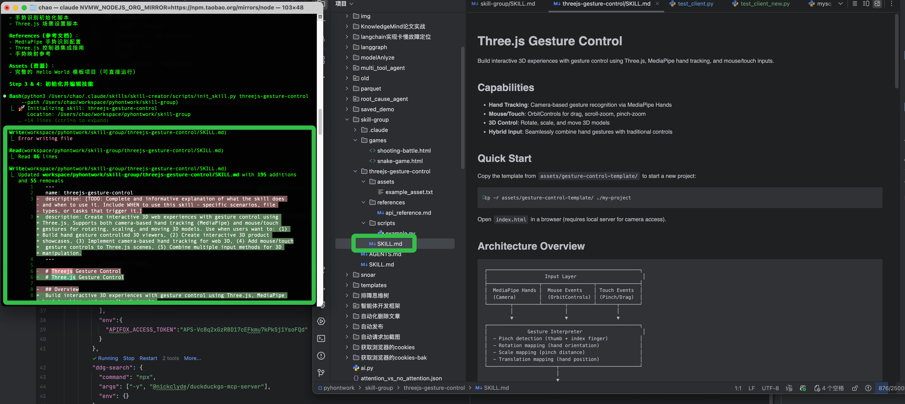

### 3）哪些任务值得做成 Skill？

如果一个任务满足以下条件中的两项以上，通常就值得 Skill 化：

- 高频重复出现
- 每次都需要解释规则
- 输出结果需要保持一致
- 希望团队其他成员也能复用
- 已经形成较成熟的方法

这类任务往往包括：代码审查、文档生成、页面设计、测试生成、部署检查、数据整理等。

---

## 十二、如何寻找适合自己的开源 Skills？

刚接触 Skills 时，不建议一开始就收藏大量资源。更有效的方法通常是：

- 先找与自己当前工作流最相关的方向
- 先用熟少量高频 Skill
- 再逐步扩展能力范围

常见起点包括：

- `frontend-design`
- `code-simplifier`
- `ralph-loop`

相关分类资源如下：

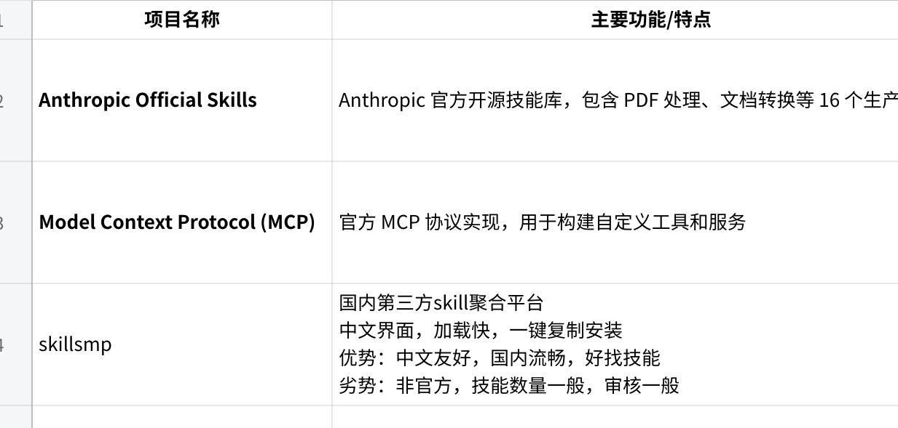

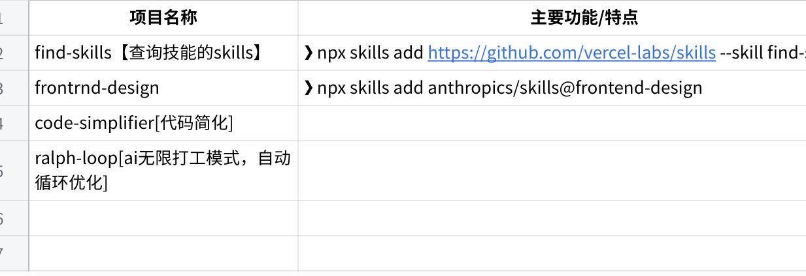

---

## 十三、初学者常见误区

### 1）把 Skill 当成更长的 Prompt

Skill 不是 Prompt 的简单加长版，而是任务处理方案的结构化封装。

### 2）认为 Skill 越长越好

Skill 的质量不取决于篇幅，而取决于触发条件、执行规则和输出结构是否清晰。

### 3）认为装得越多越好

更有效的做法通常是先用熟最贴近当前工作的几个 Skill。

### 4）直接照抄旧命令

建议始终确认当前版本、当前环境和当前官方推荐写法。

### 5）只会安装，不会沉淀

长期来看，真正有价值的是把自己的工作方法逐步沉淀成可复用 Skill。

---

## 十四、落地建议

如果今天就准备开始尝试，更建议优先做这三件事：

### 1）先启用 Skills 功能

先把入口打开，确保链路可用。

### 2）先安装 1~3 个高频 Skill

优先选择与你当前工作最贴近的场景，而不是追求数量。

### 3）尽快做出第一个自己的 Skill

这是从“使用 AI”走向“构建 AI 工作流”的关键一步。

---

## 结语

Skills 的价值，不只是让 AI 更会回答问题，而是让 AI 在一类任务上变得更稳定、更一致、更接近真实工作场景中的协作要求。

当你真正开始使用 Skills，你会发现它解决的不是“怎么问得更好”，而是“怎么让 AI 长期按同一种高质量方式做事”。

这也是它在未来工作流中越来越重要的原因。