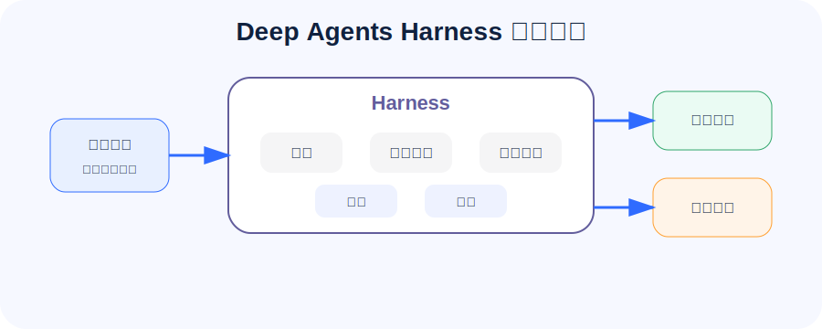

## 为什么 Deep Agents 不是“再封装一个 Agent”

如果只是做一个能调用工具的聊天机器人，普通 LangChain Agent 已经够用。但一旦任务变长，问题会立刻冒出来：

- 任务需要先计划，再分阶段执行。
- 中间资料越来越多，上下文窗口放不下。
- 有些工作应该交给专家子智能体。
- 生成的草稿、证据、报告需要有文件系统承载。
- 危险操作需要人工审批。
- 生产环境要考虑用户、线程、记忆、权限和观测。

Deep Agents 的价值就在这里：它不是只帮你“调模型”，而是把长任务 Agent 常见的工程脚手架打包成一套 Harness。

一句大白话：**Deep Agents 是 LangGraph 之上的“长任务智能体套件”，重点解决规划、上下文、文件、子智能体和生产化。**

## 第一讲先看一个资料研究员

代码已保存到：`output/courses/deepagents/code/01_quickstart_research_agent.py`。

这个例子严格对齐官方 quickstart 的主线：**安装 Deep Agents 和 Tavily，创建 `internet_search` 工具，再用 `create_deep_agent` 组装一个研究员 Agent**。

为了保证可跑、可学、可扩展，我在官方示例基础上做了两个增强：

- 优先使用 Tavily 做真实互联网搜索。
- 如果暂时没有 `TAVILY_API_KEY`，自动退回本地迷你知识库，方便先理解流程。

这个例子把 Agent 设定成资料研究员：

1. 用户提出研究问题。
2. Agent 先规划要研究的方向。
3. 调用 `internet_search` 检索资料；有 Tavily key 就联网搜索，没有 key 就本地演示。
4. 把证据整理成结论和学习路线。

## 官方 quickstart 完整流程

官方快速入门包含 5 个步骤，少任何一个都容易让新手卡住。

### Step 0：前置条件

Deep Agents 需要一个**支持 tool calling 的模型**。也就是说，模型不只是会聊天，还要能稳定地产生“我要调用哪个工具、参数是什么”的结构化请求。

常见模型写法是 `provider:model`：

```text
google_genai:gemini-3.5-flash
openai:gpt-4o-mini
anthropic:claude-sonnet-4-6
```

### Step 1：安装依赖

官方 quickstart 的安装命令是：

```bash
pip install deepagents tavily-python
```

本课程为了覆盖后续章节，还把 LangGraph、LangChain、QuickJS 解释器等依赖放进了 `requirements.txt`：

```bash
cd /Users/chao/Desktop/分享文档库/output/courses/deepagents/code
pip install -r requirements.txt
```

其中最容易漏掉的是 `tavily-python`。如果少了它，官方搜索工具示例就跑不起来。

### Step 2：配置 API keys

官方示例使用 Gemini 和 Tavily：

```bash
export GOOGLE_API_KEY="your-api-key"
export TAVILY_API_KEY="your-tavily-api-key"
```

本课程默认用 `.env`，更适合本地反复学习：

```bash
DEEPAGENTS_MODEL=openai:gpt-4o-mini
OPENAI_API_KEY=你的模型网关 key
OPENAI_BASE_URL=https://你的模型网关/v1
TAVILY_API_KEY=你的 tavily key
RUN_AGENT=true
```

如果你改用 `google_genai:*`，再填写：

```bash
GOOGLE_API_KEY=你的 google key
```

### Step 3：创建搜索工具

官方示例中的工具叫 `internet_search`，核心代码是：

```python
from tavily import TavilyClient

tavily_client = TavilyClient(api_key=os.environ["TAVILY_API_KEY"])

def internet_search(query: str, max_results: int = 5, topic: str = "general"):
    return tavily_client.search(query, max_results=max_results, topic=topic)
```

课程代码做了更适合新手的版本：

- 有 `TAVILY_API_KEY`：真实调用 Tavily。
- 没有 `TAVILY_API_KEY`：回退到本地知识库。
- 返回结构保持一致，方便理解工具结果如何进入 Agent。

### Step 4：创建 deep agent

核心代码结构如下：

```python
from deepagents import create_deep_agent

agent = create_deep_agent(
    model="openai:gpt-4o-mini",
    tools=[internet_search],
    system_prompt=RESEARCH_INSTRUCTIONS,
)
```

看起来很短，但 Deep Agents 会自动加入很多 Harness 能力，比如待办列表、虚拟文件系统、上下文管理和默认的通用子智能体。

### Step 5：运行 agent

官方运行方式是：

```python
result = agent.invoke({
    "messages": [{"role": "user", "content": "What is langgraph?"}]
})

print(result["messages"][-1].content)
```

本课程对应命令：

```bash
python 01_quickstart_research_agent.py
```

运行时 Deep Agents 会自动做几件事：

1. 用内置 `write_todos` 拆解研究计划。
2. 调用 `internet_search` 搜索资料。
3. 用 `write_file` / `read_file` 等虚拟文件系统工具卸载大段资料。
4. 必要时派发默认 `general-purpose` 子智能体。
5. 汇总证据，生成最终报告。

## Harness 到底在帮你做什么

可以把 Harness 想成一个“智能体操作系统”。模型负责推理，Harness 负责让推理过程可控。

| 能力 | 作用 | 大白话 |
| --- | --- | --- |
| Planning | 维护任务计划 | 先把活拆开，不要想到哪做到哪 |
| Filesystem | 读写临时文件 | 草稿、证据、报告不要全塞进 prompt |
| Subagents | 派发专家任务 | 主 Agent 当项目经理，子 Agent 当专家 |
| Context management | 压缩和隔离上下文 | 避免长任务把上下文撑爆 |
| HITL | 人工审批 | 删文件、发邮件、发布报告前先让人点头 |
| Memory / Skills | 长期知识和按需能力 | 该长期记住的记住，该按需加载的按需加载 |

官方文档把这些能力称为 Harness capabilities。它的关键不是“让模型更玄学”，而是把长任务中必需的工程能力做成默认脚手架。

## 和 LangGraph 的关系

Deep Agents 底层依赖 LangGraph。可以这样理解：

- LangGraph 解决“执行过程是一张图”。
- Deep Agents 解决“长任务 Agent 常用图怎么搭”。

LangGraph 更像基础设施；Deep Agents 更像带默认配置的工程模板。

如果你要完全控制节点、边、状态和中断，就直接写 LangGraph；如果你要快速做一个能规划、能读写文件、能调子智能体、能上线的长任务 Agent，Deep Agents 更顺手。

## 官方 quickstart 的关键点

官方快速入门里的典型写法是：

```python
agent = create_deep_agent(
    model="google_genai:gemini-3.5-flash",
    tools=[internet_search],
    system_prompt=research_instructions,
)

result = agent.invoke({
    "messages": [{"role": "user", "content": "What is langgraph?"}]
})
```

这里有五个重点：

1. `model` 可以用 `provider:model` 字符串。
2. 模型必须支持 tool calling。
3. `tools` 是 Agent 接触外部世界的入口，quickstart 用的是 Tavily 搜索。
4. `system_prompt` 不只是角色设定，更是 Harness 行为约束的一部分。
5. Deep Agents 会自动使用 planning、filesystem、subagents 和 context management。

## Streaming：快速入门后必须知道的观察方式

官方 quickstart 后面还提到 streaming。长任务如果没有流式输出，用户会觉得系统像卡住了。

最小写法：

```python
for chunk in agent.stream(
    {"messages": [{"role": "user", "content": "Research LangGraph"}]},
    stream_mode="updates",
    subgraphs=True,
    version="v2",
):
    print(chunk)
```

这能看到主 Agent 和子智能体的执行进度。第五讲会专门讲 streaming 和 event streaming。

## 本讲示例为什么默认不直接调用模型

课程代码默认 `RUN_AGENT=false`。这样做是为了让你先安全检查结构，不会因为 key、模型网关或额度问题卡在第一步。

要真实运行时，进入代码目录：

```bash
cd /Users/chao/Desktop/分享文档库/output/courses/deepagents/code
cp .env.example .env
```

然后填写：

```bash
DEEPAGENTS_MODEL=openai:gpt-4o-mini
OPENAI_API_KEY=你的 key
OPENAI_BASE_URL=https://你的模型网关/v1
TAVILY_API_KEY=你的 Tavily key
RUN_AGENT=true
```

再执行：

```bash
python 01_quickstart_research_agent.py
```

## 如果搜索成功但模型调用 502

你刚开始跑真实网关时，最常见的坑是：Tavily 搜索已经成功，但模型调用报 502。

判断方式很简单：如果报错栈里出现 `responses.create`，说明当前 SDK 可能走了 OpenAI Responses API。很多公司内部网关、LiteLLM、One API 只支持 `/chat/completions`，不支持 `/responses`。

本课程代码已经默认处理：

```bash
DEEPAGENTS_USE_RESPONSES_API=false
```

并且在 `common.py` 里显式创建 `ChatOpenAI`，让 OpenAI 兼容网关走 Chat Completions。还额外做了两件事：

- `load_dotenv(..., override=True)`：防止终端里残留的旧 key 覆盖 `.env`。
- `httpx.Client(trust_env=False)`：防止系统代理影响内网模型网关。

大白话：**Tavily 成功只能说明搜索服务没问题；模型 502 要看模型网关、模型名、接口模式和网络代理。**

## 第一讲要记住的 5 句话

1. **Deep Agents 面向长任务，不只是聊天。**
2. **Harness 是长任务 Agent 的工程脚手架。**
3. **LangGraph 是底座，Deep Agents 是默认组装好的 Agent 形态。**
4. **文件系统和子智能体是 Deep Agents 的核心体验。**
5. **先跑结构，再接真实模型，是学习这类框架最稳的路径。**

## 下一讲讲什么

下一讲进入定制：模型怎么换、工具怎么挂、提示词怎么组装、结构化输出和子智能体怎么配置。
