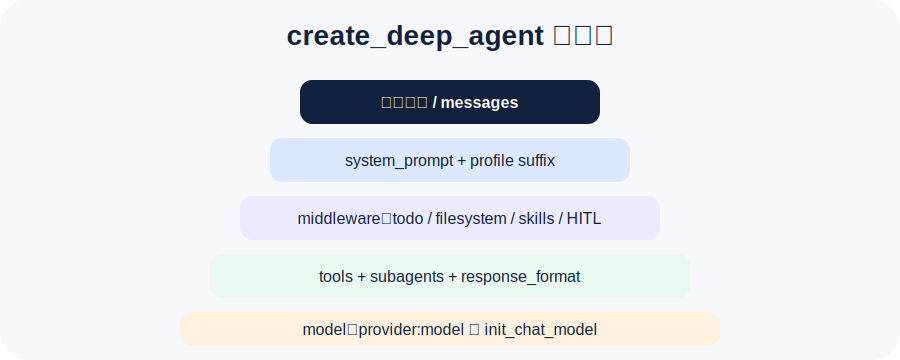

## create_deep_agent 是一个“装配入口”

Deep Agents 的核心入口是 `create_deep_agent(...)`。它不是只接收一个模型，而是把 Agent 的各层能力都装配起来：

- `model`：使用哪个模型。
- `tools`：Agent 可以调用哪些外部能力。
- `system_prompt`：主要行为规则。
- `middleware`：额外执行逻辑。
- `subagents`：可委派的专家角色。
- `skills` / `memory`：按需能力和长期上下文。
- `permissions` / `interrupt_on`：安全边界和人工审批。
- `response_format`：结构化输出。

大白话：**Deep Agents 的定制不是改一个 prompt，而是在组装一个可运行的工作系统。**

## 模型配置：provider:model

官方推荐的简化写法是：

```python
agent = create_deep_agent(
    model="openai:gpt-4o-mini",
)
```

也可以换成其他 provider：

```python
model="anthropic:claude-sonnet-4-6"
model="google_genai:gemini-3.5-flash"
model="openrouter:anthropic/claude-sonnet-4.5"
```

前提是这个模型要支持 tool calling。因为 Deep Agents 的 Harness 很多能力都需要模型能可靠地产生工具调用。

## 工具：不要只写函数，要写清楚边界

本讲示例代码：`output/courses/deepagents/code/02_customization_models_tools.py`。

里面有一个渠道评估工具：

```python
@tool
def estimate_channel_fit(channel: str, audience: str) -> str:
    """评估某个投放渠道与目标受众的匹配程度。"""
    ...
```

工具描述很重要。模型选择工具时，主要看的就是函数名、参数和 docstring。

一个好的工具描述要回答三件事：

1. 这个工具做什么。
2. 什么时候该用。
3. 输入输出边界是什么。

## Prompt assembly：提示词不是一整坨

官方文档里提到 Deep Agents 会组装系统提示词。可以粗略理解为：

```text
用户自定义 system_prompt
+ Deep Agents 基础 Harness Prompt
+ Todo / Filesystem / Skills / Memory 等中间件提示
+ Profile suffix
```

这意味着你写的 `system_prompt` 是第一层业务规则，Deep Agents 自己还会追加 Harness 运行规则。

所以业务 prompt 不建议写成“万能长文”。更好的方式是：

- 业务目标写在 `system_prompt`。
- 大块流程知识放到 `skills`。
- 长期偏好放到 `memory`。
- 风险控制交给 `permissions` 和 `interrupt_on`。

## 结构化输出：让 Agent 给系统能用的结果

示例里定义了一个 Pydantic 模型：

```python
class CampaignBrief(BaseModel):
    title: str
    audience: str
    channels: list[str]
    risks: list[str]
```

然后传给：

```python
response_format=CampaignBrief
```

这样最终结果不只是自然语言，而更接近后端系统可以继续处理的数据结构。

官方文档里强调：结构化结果会被校验后放在状态里的 `structured_response` 字段中。也就是说，真实运行后通常这样取：

```python
result = agent.invoke({"messages": [{"role": "user", "content": "..."}]})
print(result["structured_response"])
```

适合使用结构化输出的场景：

- 生成任务单。
- 生成评审结论。
- 生成报告元数据。
- 生成下一步执行计划。
- 作为 API 返回给前端。

## Subagents：把专家角色变成可委派资源

示例里定义了一个风险审查子智能体：

```python
SUBAGENTS = [
    {
        "name": "risk-reviewer",
        "description": "检查营销方案中的合规、预算和执行风险。",
        "system_prompt": "你是谨慎的风险审查员，只输出风险和缓解建议。",
    }
]
```

主 Agent 不需要把所有事情都塞进自己的上下文。遇到风险审查，就把任务交给 `risk-reviewer`，拿到浓缩结论后再整合。

这就是上下文隔离：**让专家在自己的小房间里干活，最后只把结果带回来。**

## Profile：按模型调 Harness 行为

Profiles 用来给不同模型设置不同 Harness 行为。比如某个模型容易乱调用 shell，就可以注册 profile 排除 `execute` 工具：

```python
register_harness_profile(
    "openai:gpt-5.4",
    HarnessProfile(
        excluded_tools={"execute"},
        system_prompt_suffix="Respond in under 100 words.",
    ),
)
```

这是一个很工程化的设计：同一套业务代码，在不同模型下可以有不同工具可见性、提示词后缀和中间件策略。

## 第二讲要记住的 5 句话

1. **模型要支持 tool calling。**
2. **工具描述决定模型会不会正确使用工具。**
3. **system_prompt 是业务规则，不是所有知识的垃圾桶。**
4. **response_format 能把 Agent 结果变成系统可处理的数据。**
5. **subagents 是上下文隔离和专家分工的关键。**

下一讲进入上下文工程、后端、记忆和 Skills。那部分才是真正让长任务跑得稳的核心。
