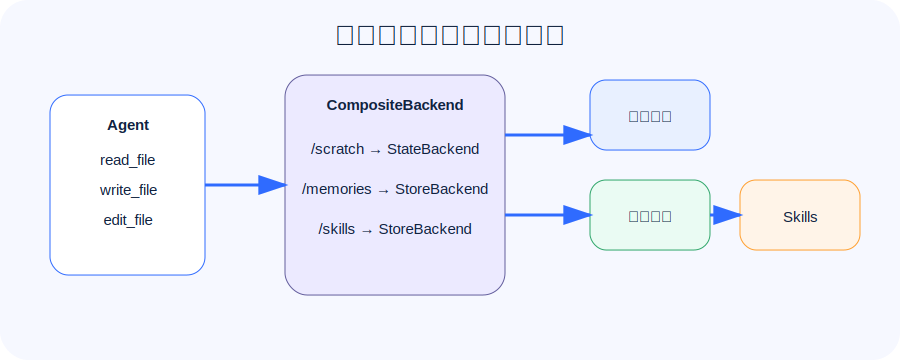

## 长任务 Agent 最容易死在上下文里

很多 Agent Demo 看起来惊艳，但一到真实任务就变脆：

- 搜到的资料太多，prompt 装不下。
- 中间推理全塞进消息历史，越跑越慢。
- 每次对话都要重复解释用户偏好。
- 大块操作手册放在系统提示词里，浪费 token。
- 多个用户共享记忆，容易互相污染。

Deep Agents 文档把这些问题归到一个主题：context engineering。

一句大白话：**上下文工程就是决定什么信息该进模型脑子，什么信息该放文件，什么信息该长期记住，什么信息该隔离出去。**

## 五类上下文

官方文档把上下文拆成几类：

| 类型 | 说明 | 例子 |
| --- | --- | --- |
| Input context | 用户本次输入 | “帮我分析这批订单” |
| Runtime context | 运行时身份与配置 | user_id、org_id、权限、地域 |
| Compression | 压缩长信息 | 把 30 页资料压成摘要 |
| Isolation | 隔离上下文 | 子智能体独立阅读资料，只返回结论 |
| Long-term memory | 跨会话记忆 | 用户偏好、项目规范、历史经验 |

这些不是“模型技巧”，而是系统设计问题。

## Backend：文件系统能力的落点

Deep Agents 内置虚拟文件系统工具：

- `ls`
- `read_file`
- `write_file`
- `edit_file`
- `glob`
- `grep`
- 在 sandbox 后端里还有 `execute`

这些工具背后由 Backend 决定数据放在哪里。

常见 Backend：

| Backend | 用途 |
| --- | --- |
| StateBackend | 默认短期状态，适合单线程草稿 |
| FilesystemBackend | 读写本地磁盘，开发时方便 |
| StoreBackend | 接 LangGraph Store，适合持久化记忆 |
| CompositeBackend | 按路径路由到不同 Backend |
| Sandbox Backend | 给 Agent 一个隔离环境和 `execute` 能力 |

## CompositeBackend：像 Nginx 一样按路径转发

可以把 CompositeBackend 想成文件系统里的路由器：

```python
CompositeBackend(
    default=StateBackend(),
    routes={
        "/memories/": StoreBackend(namespace=lambda rt: (rt.server_info.user.identity,)),
        "/skills/": StoreBackend(namespace=lambda rt: ("skills", "builtin")),
    },
)
```

这样：

- 临时草稿走 StateBackend。
- 长期记忆走 StoreBackend。
- Skills 可以走共享 Store。

好处是同一个 Agent 看到的是统一文件路径，但系统内部可以分别持久化、隔离和授权。

## Memory：长期记忆不是聊天历史

Deep Agents 的 memory 更像文件系统里的长期上下文。比如：

```python
memory=["/memories/preferences.md"]
```

它适合存：

- 用户偏好。
- 项目约定。
- 已验证的事实。
- Agent 自我改进记录。

不要把所有对话都塞进 memory。对话历史属于 episodic memory，可以通过 thread/checkpoint 和搜索工具召回。

## Scoped memory：千万别把用户记忆混在一起

官方文档强调两种常见作用域：

- Agent-scoped：同一个 Agent 的所有用户共享。
- User-scoped：每个用户一份，互不泄漏。

多数业务默认应该使用 User-scoped：

```python
StoreBackend(
    namespace=lambda rt: (rt.server_info.user.identity,),
)
```

共享记忆一定要谨慎。一个用户能写、另一个用户能读，就可能形成 prompt injection 的传播链。

## Skills：按需加载的大块能力

Skills 是 `SKILL.md` 加可选脚本、参考资料、模板组成的目录。它的核心机制叫 progressive disclosure：

1. 启动时只读 skill frontmatter。
2. 用户任务匹配 description 时，才读取完整 `SKILL.md`。
3. 需要时再访问附属脚本、模板和资料。

这比把一大坨说明都放进 system prompt 更省上下文。

本讲示例目录：

```text
code/skills/order-helpers/
├── SKILL.md
└── index.ts
```

`index.ts` 提供确定性订单分组函数，解释器可以这样导入：

```typescript
const { summarizeOrders } = await import("@/skills/order-helpers");
```

## Memory 和 Skills 的区别

| 对比项 | Memory | Skills |
| --- | --- | --- |
| 目的 | 长期上下文和偏好 | 可复用能力和流程知识 |
| 加载方式 | 通常启动时进入上下文 | 先看描述，匹配后再读全文 |
| 文件格式 | 常见是 AGENTS.md / md | `SKILL.md` + 附属文件 |
| 是否应写入 | 用户偏好可写，共享政策只读 | 通常开发者维护，谨慎让 Agent 写 |

一句话：**Memory 是“记住什么”，Skills 是“知道怎么做”。**

## 第三讲要记住的 5 句话

1. **长任务 Agent 的核心难点是上下文管理。**
2. **Backend 决定虚拟文件系统背后的存储位置。**
3. **CompositeBackend 可以把短期草稿、长期记忆和 Skills 分开存。**
4. **Memory 要按 user / assistant / org 做作用域隔离。**
5. **Skills 适合放大块、按需使用的流程知识。**

下一讲进入子智能体、人机协同和权限。这部分决定 Agent 能不能安全地做事。
