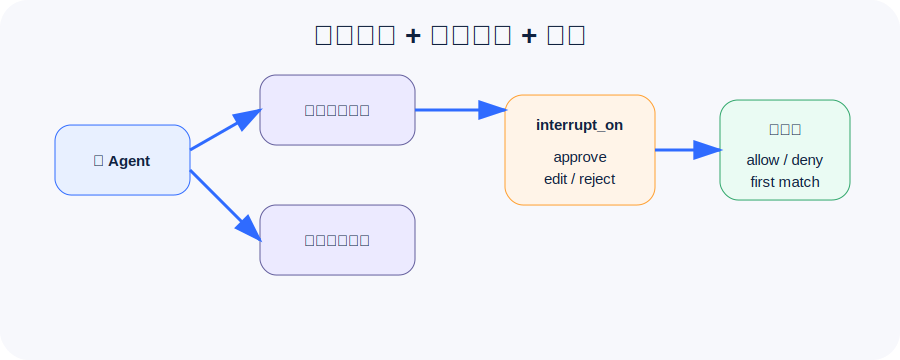

## 子智能体不是“多开几个聊天窗口”

Deep Agents 的 subagents 解决的是上下文隔离和专家分工。

主 Agent 像项目经理，负责判断任务怎么拆；子智能体像专家，负责在自己的上下文里完成一小段工作。主 Agent 不需要看到所有中间资料，只拿最终结论。

适合拆成子智能体的任务：

- 深度资料研究。
- 代码审查。
- 合规审查。
- 数据分析。
- 文案润色。
- 长文档摘要。

## 默认 general-purpose 子智能体

Deep Agents 默认提供一个 `general-purpose` 子智能体。它适合处理通用研究、摘要和复杂子任务。

如果你不想使用它，可以关闭；如果你要更稳定的业务行为，建议定义自己的子智能体：

```python
subagents=[
    {
        "name": "compliance-reviewer",
        "description": "审查报告是否包含隐私、合规和未经批准的承诺。",
        "system_prompt": "你是合规审查员。只输出风险、证据和修改建议。",
        "tools": [read_policy],
    }
]
```

`description` 很关键。主 Agent 会根据它判断什么时候委派任务。

## 同步子智能体和异步子智能体

官方文档还提供 async subagents。区别可以这样理解：

| 类型 | 适合场景 | 大白话 |
| --- | --- | --- |
| sync subagent | 短任务、需要马上等结果 | 派活后等专家回来 |
| async subagent | 长任务、后台运行、可轮询 | 派活后先干别的，晚点查进度 |

异步子智能体会暴露任务工具：

- `start_async_task`
- `check_async_task`
- `update_async_task`
- `cancel_async_task`
- `list_async_tasks`

它适合调研、批处理、长时间分析这类任务。

## HITL：危险动作前让人插一脚

Human-in-the-loop 基于 LangGraph interrupt。你可以用 `interrupt_on` 指定哪些工具需要审批：

```python
interrupt_on={
    "publish_report": {"allowed_decisions": ["approve", "edit", "reject"]},
    "read_policy": False,
}
```

人可以做四类决策：

| 决策 | 含义 |
| --- | --- |
| approve | 按原参数执行 |
| edit | 修改参数后执行 |
| reject | 不执行这个工具 |
| respond | 直接把人的回复作为工具结果 |

注意：HITL 必须配 checkpointer。因为中断后要恢复到原来的执行现场。

```python
from langgraph.checkpoint.memory import MemorySaver

checkpointer = MemorySaver()
```

## Permissions：文件系统的声明式规则

Deep Agents 的 permissions 用来控制内置文件系统工具可以读写哪些路径。

```python
FilesystemPermission(
    operations=["write"],
    paths=["/memories/**"],
    mode="deny",
)
```

规则是 first-match-wins：第一条命中的规则决定结果。

一个常见安全配置：

```python
permissions=[
    FilesystemPermission(operations=["read", "write"], paths=["/workspace/.env"], mode="deny"),
    FilesystemPermission(operations=["write"], paths=["/memories/**"], mode="deny"),
    FilesystemPermission(operations=["read", "write"], paths=["/workspace/**"], mode="allow"),
    FilesystemPermission(operations=["read", "write"], paths=["/**"], mode="deny"),
]
```

这表示：

- `.env` 不能读写。
- 记忆只读。
- 工作区可读写。
- 其他路径全部拒绝。

## permissions 的边界

官方文档也提醒了限制：

- permissions 只管内置文件系统工具。
- 不管自定义工具。
- 不管 MCP 工具。
- 不管 sandbox 里的 `execute` 任意命令。

如果你需要控制自定义工具，应该写工具自身的校验，或用 backend policy hooks。

## Sandboxes：隔离执行环境

如果 Agent 需要运行 shell、安装依赖、跑测试，就需要 sandbox backend。

Sandbox 的价值是把 Agent 的执行环境和你的主机隔离开。它通常会提供：

- 文件系统工具。
- `execute` 命令执行工具。
- 与宿主机隔离的运行边界。

但 sandbox 不是万能保险箱。它防止 Agent 读你的本地文件，却不能防止上下文注入让 Agent 在 sandbox 内乱跑命令或发网络请求。

安全建议：

1. 不要把秘密放进 sandbox。
2. 需要外部 API 时，优先用宿主机工具封装认证。
3. 高风险操作开启 HITL。
4. 能禁网络就禁网络。
5. 把 sandbox 输出当作不可信输入。

## 第四讲要记住的 5 句话

1. **子智能体的核心价值是上下文隔离。**
2. **description 决定主 Agent 会不会正确委派。**
3. **HITL 需要 checkpointer 和同一个 thread_id。**
4. **permissions 是路径级规则，first-match-wins。**
5. **sandbox 隔离宿主机，但不能替代权限、审批和审计。**

下一讲进入解释器、流式输出和生产化部署。
