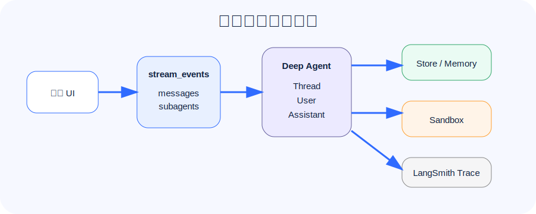

## 为什么还需要解释器

普通工具调用是一问一答：模型决定调用一个工具，工具返回结果，模型再决定下一步。

当任务需要循环、分支、批处理、聚合时，这种模式会很啰嗦：每一步都要回到模型，token 和延迟都上去了。

Interpreters 提供了另一个路径：让 Agent 写一小段 TypeScript，在 QuickJS 运行时里执行，用代码完成中间处理，再把紧凑结果交回模型。

一句大白话：**解释器是 Agent 循环里的“临时编程工作台”，不是完整操作系统。**

## 解释器适合做什么

适合：

- 批量调用工具。
- 对结构化数据排序、分组、聚合。
- 多个子任务并发后汇总。
- 保存中间变量，避免都塞回上下文。
- 调用 interpreter skills 里的确定性函数。

不适合：

- 安装依赖。
- 跑 shell。
- 读写真实文件系统。
- 访问任意网络。

这些应该交给 sandbox。

## CodeInterpreterMiddleware

基础写法：

```python
from langchain_quickjs import CodeInterpreterMiddleware

agent = create_deep_agent(
    model="openai:gpt-4o-mini",
    middleware=[CodeInterpreterMiddleware()],
)
```

如果要让解释器能调用指定工具，要开启 programmatic tool calling：

```python
CodeInterpreterMiddleware(ptc=["task"])
```

这样解释器里的代码可以：

```typescript
const reports = await Promise.all(
  topics.map((topic) =>
    tools.task({
      description: `Research ${topic}`,
      subagent_type: "general-purpose",
    }),
  ),
);
```

注意：PTC 是一条特殊桥接路径，文档提醒它不会逐个触发 `interrupt_on` 审批。因此只暴露必要工具。

## Streaming：让长任务不再像黑盒

Deep Agents 继承 LangGraph streaming，并强化了 subagent 场景。

旧一点的方式是：

```python
for chunk in agent.stream(
    input,
    stream_mode=["updates", "messages", "custom"],
    subgraphs=True,
    version="v2",
):
    print(chunk)
```

你可以看到：

- 主 Agent 走到哪个节点。
- 子智能体何时开始、何时结束。
- 模型 token。
- 工具调用和工具结果。
- 工具内部自定义进度。

## Event streaming：新应用更推荐

Deep Agents v0.6 引入了 typed projection 风格的 `stream_events`。它可以按投影消费：

```python
stream = agent.stream_events(input, version="v3")

for subagent in stream.subagents:
    print(subagent.name, subagent.status)
    for message in subagent.messages:
        print(message.text)
```

这个 API 更适合前端：

- `stream.messages` 显示协调者消息。
- `stream.tool_calls` 显示顶层工具。
- `stream.subagents` 显示子智能体卡片。
- `subagent.messages` 显示子智能体自己的输出。
- `subagent.tool_calls` 显示子智能体工具进度。

大白话：**subgraphs 是执行结构，subagents 是产品概念。给用户看，优先看 subagents。**

## 生产化三件套：Thread、User、Assistant

官方 production 文档里，最关键的三个对象是：

| 对象 | 含义 |
| --- | --- |
| Thread | 一次会话或任务线程 |
| User | 最终用户身份，用于隔离记忆和权限 |
| Assistant | 某个 Agent 配置或版本 |

这三个对象会影响：

- checkpointer 怎么存。
- memory namespace 怎么划。
- sandbox 生命周期怎么定。
- 权限和审计怎么做。

## langgraph.json：部署入口

Deep Agents 可以像 LangGraph 应用一样注册到 `langgraph.json`：

```json
{
  "dependencies": ["."],
  "graphs": {
    "deepagents_course_agent": "./05_streaming_interpreters_production.py:agent"
  },
  "env": ".env"
}
```

本讲代码 `05_streaming_interpreters_production.py` 会生成这个文件。

## 上生产前的检查清单

### 1. 模型与工具

- 模型是否支持 tool calling？
- 工具是否有明确边界？
- 高成本工具是否限流？
- 高风险工具是否 HITL？

### 2. 记忆与权限

- 用户记忆是否按 user_id 隔离？
- 组织政策是否只读？
- `.env`、密钥、内部文件是否禁止读取？
- 自定义工具是否自行校验权限？

### 3. 执行环境

- 需要 shell 就用 sandbox。
- 不要把 secrets 放进 sandbox。
- sandbox 设置 TTL，避免资源泄漏。
- 输出进入业务系统前要再校验。

### 4. 可观测性

- 开启 LangSmith tracing。
- 记录工具调用、审批决策和 memory 写入。
- 前端展示流式进度，避免用户以为系统卡死。

## 第五讲要记住的 5 句话

1. **解释器适合在 Agent 循环内做批处理和聚合。**
2. **sandbox 适合真实 shell、依赖安装和测试执行。**
3. **Streaming 让长任务可观察。**
4. **event streaming 更适合新前端应用。**
5. **生产化要围绕 Thread、User、Assistant 做隔离和治理。**

## 系列收束

到这里，Deep Agents 的主线就完整了：

- 第一讲：Harness 心智模型。
- 第二讲：模型、工具和定制。
- 第三讲：上下文、后端、记忆和 Skills。
- 第四讲：子智能体、安全边界和人工审批。
- 第五讲：解释器、流式输出和生产化。

如果只记一句话：**Deep Agents 不是让 Agent 更会聊天，而是让 Agent 更能长期、安全、可观察地完成复杂任务。**
