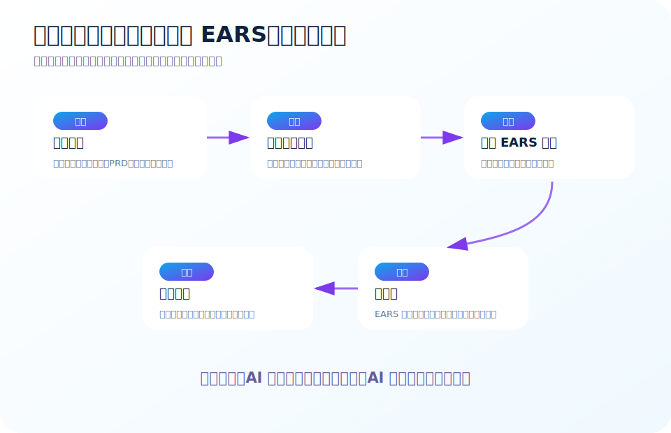

# 用大模型辅助 EARS 需求转化：从会议纪要到标准需求、验收用例和追踪矩阵

EARS 很适合和大模型结合。

原因很简单：

- EARS 有固定句式
- 大模型擅长信息抽取和改写
- 需求材料通常是自然语言
- 大模型可以快速发现“没说清楚”的地方

但要先说清楚一个原则：

> **大模型不是需求负责人。大模型负责整理、改写、检查和提出问题；业务事实、规则取舍、优先级和最终签收必须由人确认。**

大白话：

> AI 可以当需求助理，不能当业务老板。

---

## 推荐总流程



推荐把大模型辅助 EARS 转化拆成 6 步：

1. **输入原始材料**：会议纪要、访谈记录、PRD、用户故事、工单、聊天记录。
2. **抽取候选需求**：从材料中找出可能的需求点。
3. **识别需求要素**：主体、触发、状态、异常、响应、数据、权限、质量属性。
4. **转换为 EARS 草案**：按普遍型、事件型、状态型、异常型、可选特性型生成需求。
5. **质量检查与问题清单**：检查歧义、漏项、冲突、不可验证内容。
6. **人工确认与入库**：产品、业务、开发、测试共同确认后进入需求库。

---

## 阶段 1：从原始材料抽取候选需求

### 适用输入

- 会议纪要
- 录音转写文本
- 用户访谈记录
- 飞书/企业微信聊天记录
- 客服反馈
- 工单描述
- 旧版 PRD
- 竞品分析记录

### 提示词模板

```text
你是资深需求工程师。请从以下原始材料中抽取候选需求。

要求：
1. 只抽取材料中明确出现或强烈暗示的需求，不要编造业务规则。
2. 每条候选需求只表达一个需求点。
3. 标注需求来源：引用原文或概括对应原文位置。
4. 初步判断需求类型：功能、异常、权限、数据、性能、安全、审计、兼容性、待澄清。
5. 输出表格：编号、候选需求、来源原文、类型、置信度、待澄清问题。

原始材料：
<<<粘贴原始材料>>>
```

### 推荐输出格式

| 编号 | 候选需求 | 来源原文 | 类型 | 置信度 | 待澄清问题 |
| --- | --- | --- | --- | --- | --- |
| R-001 | 用户可按订单编号查询订单 | “希望能按订单号查订单” | 功能 | 高 | 是否支持模糊查询？ |
| R-002 | 查询订单需要较快返回 | “不能等太久” | 性能 | 中 | 响应时间指标是多少？ |

### 人工检查重点

- 模型有没有把建议当需求？
- 有没有把背景信息误当需求？
- 有没有漏掉异常、权限、状态？
- 置信度低的需求是否需要业务确认？

---

## 阶段 2：抽取 EARS 要素

EARS 转化前，要先抽取需求要素。

### 提示词模板

```text
请对以下候选需求进行 EARS 要素分析。

请识别：
1. 系统主体：哪个系统、模块、页面、服务或接口负责响应？
2. 触发事件：什么时候发生？
3. 状态条件：在什么状态期间有效？
4. 异常条件：什么情况属于失败、非法或非期望？
5. 系统响应：系统必须做什么？
6. 输出结果：用户、接口、数据、日志、消息或状态有什么变化？
7. 权限条件：谁可以做？谁不可以做？
8. 数据范围：涉及哪些字段、对象、时间范围或数量限制？
9. 质量属性：性能、安全、审计、可用性、兼容性等要求。
10. 缺失信息：哪些信息不足以写成可验证需求？

候选需求：
<<<粘贴候选需求列表>>>
```

### 输出格式

| 编号 | 主体 | 触发 | 状态 | 异常 | 响应 | 权限 | 数据范围 | 质量属性 | 缺失信息 |
| --- | --- | --- | --- | --- | --- | --- | --- | --- | --- |

### 人工检查重点

这一阶段不要急着写标准需求。

先把要素看清楚。

大白话：

> 先把菜洗好切好，再下锅。不要一边猜一边炒。

---

## 阶段 3：生成 EARS 草案

### 提示词模板

```text
请将以下需求要素转换为 EARS 风格需求。

EARS 句式：
1. 普遍型：<系统>应<响应>。
2. 事件型：当<触发事件>时，<系统>应<响应>。
3. 状态型：当<对象处于某状态>期间，<系统>应<响应>。
4. 异常型：如果<异常条件>，则<系统>应<响应>。
5. 可选特性型：在<功能/配置/授权启用>的情况下，<系统>应<响应>。
6. 组合型：当<状态>期间，且<触发事件>发生时，<系统>应<响应>。

要求：
- 一条需求只表达一个可验证行为。
- 不使用“快速、友好、灵活、合理、适当、尽量”等模糊词；无法确定时写入待澄清问题。
- 明确系统主体、触发、状态、异常、响应和可观察结果。
- 不要编造业务规则。
- 输出：需求编号、EARS 类型、EARS 需求、验收提示、待澄清问题。

需求要素：
<<<粘贴需求要素表>>>
```

### 推荐输出格式

| 编号 | EARS 类型 | EARS 需求 | 验收提示 | 待澄清问题 |
| --- | --- | --- | --- | --- |

### 注意事项

如果模型把一句复杂需求写成超长句，要要求它拆分。

可以追加提示：

```text
请检查上面生成的 EARS 需求，凡是包含多个行为、多个结果或多个异常的需求，都拆成多条原子需求。
```

---

## 阶段 4：生成验收用例

EARS 的一个关键价值，是能自然转成验收用例。

### 提示词模板

```text
请根据以下 EARS 需求生成验收用例。

要求：
1. 每条 EARS 需求至少生成 1 条验收用例。
2. 用 Given / When / Then 格式表达。
3. 覆盖正常路径、异常路径、权限路径、边界路径。
4. 标注对应需求编号。
5. 如果需求不可测试，请指出原因并提出需求修改建议。

EARS 需求：
<<<粘贴需求列表>>>
```

### 输出格式

| 用例编号 | 对应需求 | Given | When | Then | 类型 |
| --- | --- | --- | --- | --- | --- |
| TC-001 | R-001 | 用户账号存在且密码正确 | 用户提交登录表单 | 系统创建会话并跳转首页 | 正常 |
| TC-002 | R-002 | 用户账号不存在 | 用户提交登录表单 | 系统拒绝登录并提示错误 | 异常 |

### 人工检查重点

- 用例是否真的覆盖需求？
- Then 是否可观察？
- 是否缺少边界条件？
- 是否把实现细节当验收标准？

---

## 阶段 5：质量检查

### 提示词模板

```text
请对以下 EARS 需求进行质量检查。

检查维度：
1. 原子性：一条需求是否只表达一个行为？
2. 明确性：主体、触发、状态、响应是否清楚？
3. 可验证性：是否能写出明确测试用例？
4. 必要性：是否能追溯到业务目标或约束？
5. 一致性：是否存在互相冲突或重复？
6. 完整性：是否缺少异常、权限、状态、边界、数据范围、性能、安全、审计？
7. 语言质量：是否存在模糊词、主观词、不可量化词？

输出：
- 问题编号
- 对应需求编号
- 问题类型
- 问题说明
- 修改建议
- 改写版本
- 是否需要业务确认

EARS 需求：
<<<粘贴需求列表>>>
```

### 质量检查示例

| 问题 | 类型 | 说明 | 修改建议 |
| --- | --- | --- | --- |
| R-003 使用“快速” | 模糊词 | 不知道响应时间指标 | 改为“2 秒内返回 95% 请求” |
| R-007 包含两个行为 | 非原子 | 同时创建订单和扣库存 | 拆成两条需求 |
| R-011 缺少权限条件 | 完整性 | 不知道谁能导出 | 增加“具备导出权限的用户” |

---

## 阶段 6：生成需求追踪矩阵

EARS 最终应该进入需求管理，而不是停留在文档里。

### 提示词模板

```text
请根据以下 EARS 需求和验收用例，生成需求追踪矩阵。

要求：
1. 每条需求都要有唯一编号。
2. 每条需求关联至少一个验收用例。
3. 标注需求类型、优先级、来源、状态、负责人。
4. 如果某条需求没有验收用例，请标记为风险。
5. 如果某个验收用例没有对应需求，请标记为范围外用例。

输入：
EARS 需求：
<<<粘贴需求>>>

验收用例：
<<<粘贴用例>>>
```

### 输出格式

| 需求编号 | EARS 需求 | 类型 | 优先级 | 来源 | 对应用例 | 状态 | 风险 |
| --- | --- | --- | --- | --- | --- | --- | --- |

---

## 大模型使用的 8 条规则

### 规则 1：明确告诉模型不要编造

需求工程里最怕模型“替业务做主”。

提示词里必须写：

> 不要编造业务规则。无法确定的信息写入待澄清问题。

### 规则 2：要求模型保留来源

每条需求最好能追溯原文。

否则评审时不知道它从哪来。

### 规则 3：让模型先提问，再改写

如果原始需求很模糊，不要直接让模型改写。

先让它列待澄清问题。

### 规则 4：分阶段处理，不要一个 prompt 做完所有事

不要一次要求：抽取、改写、检查、生成用例、生成计划。

容易混乱。

推荐分为：

- 抽取
- 要素分析
- EARS 改写
- 质量检查
- 用例生成
- 追踪矩阵

### 规则 5：复杂需求必须拆分

提示模型：

> 如果一条需求包含多个行为、多个结果或多个异常，请拆分成多条原子需求。

### 规则 6：让模型输出待澄清问题

这非常重要。

EARS 的价值不是假装需求都清楚，而是暴露“不清楚”。

### 规则 7：人类必须确认指标

性能、安全、权限、合规、金额阈值等指标必须由人确认。

模型可以建议，但不能决定。

### 规则 8：把提示词产品化

不要每个人自己写 prompt。

团队应该沉淀统一提示词模板。

最好放在：

- 需求模板库
- 知识库
- 内部 Agent skill
- 需求管理工具的自动化按钮

---

## 可落地的半自动化实现方案

如果团队希望把 EARS + 大模型做成工具，可以按下面方案实现。

### 方案一：轻量级人工流程

适合小团队。

流程：

1. 产品把会议纪要粘贴到大模型。
2. 使用“需求抽取提示词”。
3. 产品确认候选需求。
4. 使用“EARS 改写提示词”。
5. 测试使用“验收用例提示词”。
6. 评审会上确认待澄清问题。

优点：成本低，上手快。

缺点：依赖个人习惯，不易标准化。

### 方案二：文档模板 + AI 助手

适合中型团队。

流程：

1. PRD 模板里固定包含“原始描述 / EARS 需求 / 验收用例 / 待澄清问题”。
2. AI 助手根据原始描述自动生成 EARS 草案。
3. 产品修改确认。
4. 测试根据 EARS 生成用例。
5. 评审时只看 EARS 和未决问题。

优点：融入现有流程。

缺点：需要维护模板和使用规范。

### 方案三：需求管理系统集成

适合较成熟组织。

能力设计：

- 原始需求输入区
- 一键抽取候选需求
- 一键转换 EARS
- 自动质量检查
- 自动生成验收用例
- 自动生成追踪矩阵
- 人工确认状态流转
- 需求版本对比
- 与 Jira / TAPD / 禅道 / 飞书项目打通

推荐状态：

```text
草稿 -> AI 已整理 -> 产品已确认 -> 技术已评审 -> 测试已确认 -> 已基线化
```

关键点：

> AI 生成的内容不能直接进入基线，必须有人确认。

---

## 输出 JSON 结构建议

如果要做工具化，可以让大模型输出结构化 JSON。

示例：

```json
{
  "requirements": [
    {
      "id": "R-001",
      "source": "会议纪要第 3 段",
      "raw_text": "用户可以按订单号查订单",
      "ears_type": "event-driven",
      "ears_text": "当登录用户在订单列表页输入订单编号并点击搜索按钮时，订单管理系统应展示与该订单编号匹配的订单。",
      "system": "订单管理系统",
      "trigger": "用户输入订单编号并点击搜索按钮",
      "state": null,
      "response": "展示匹配订单",
      "acceptance_criteria": [
        "给定订单编号存在，当用户搜索该订单编号时，则系统展示该订单。",
        "给定订单编号不存在，当用户搜索该订单编号时，则系统展示空结果提示。"
      ],
      "open_questions": [
        "是否支持模糊查询？",
        "是否限制查询时间范围？"
      ],
      "quality_flags": []
    }
  ]
}
```

好处：

- 方便导入需求系统
- 方便生成表格
- 方便做自动质量检查
- 方便和测试用例建立追踪关系

---

## 人工评审清单

大模型生成后，评审人员要检查这些问题。

### 产品检查

- 是否符合真实业务规则？
- 是否遗漏核心场景？
- 术语是否和业务一致？
- 待澄清问题是否已处理？

### 开发检查

- 系统主体是否正确？
- 是否能设计实现？
- 是否有冲突需求？
- 是否混入不合理实现约束？

### 测试检查

- 每条需求是否可测试？
- 是否能推导测试用例？
- 异常、边界、权限是否覆盖？
- 预期结果是否明确？

### 架构/安全检查

- 是否涉及性能、安全、审计、合规？
- 是否需要新增权限模型？
- 是否影响其他系统？
- 是否有数据隔离和敏感信息风险？

---

## 一个完整转换示例

### 原始会议纪要

> 订单列表现在查起来不方便，希望能按订单号、状态和时间查。普通用户只能看自己的订单，客服可以看自己负责客户的订单。查询不能太慢，没结果要提示。后面还要支持导出，但不是所有人都能导出。

### 第一步：候选需求抽取

| 编号 | 候选需求 | 类型 |
| --- | --- | --- |
| R-001 | 按订单号查询订单 | 功能 |
| R-002 | 按订单状态查询订单 | 功能 |
| R-003 | 按时间范围查询订单 | 功能 |
| R-004 | 普通用户只能看自己的订单 | 权限 |
| R-005 | 客服只能看负责客户的订单 | 权限 |
| R-006 | 查询性能不能太慢 | 性能 |
| R-007 | 无结果时提示 | 异常/空状态 |
| R-008 | 支持订单导出 | 功能 |
| R-009 | 导出需要权限控制 | 权限 |

### 第二步：EARS 改写

> **当普通用户打开订单列表页时，订单管理系统应仅展示该用户创建的订单。**

> **当客服用户打开订单列表页时，订单管理系统应仅展示该客服负责客户的订单。**

> **当用户在订单列表页输入订单编号并点击“搜索”按钮时，订单管理系统应展示与该订单编号匹配且在用户数据权限范围内的订单。**

> **当用户在订单列表页选择订单状态并点击“搜索”按钮时，订单管理系统应展示该状态下且在用户数据权限范围内的订单。**

> **当用户在订单列表页选择下单时间范围并点击“搜索”按钮时，订单管理系统应展示该时间范围内且在用户数据权限范围内的订单。**

> **如果订单查询条件没有匹配结果，则订单管理系统应展示“未找到匹配订单”的空结果提示。**

> **当订单查询结果不超过 1000 条时，订单管理系统应在 2 秒内返回查询结果。**

> **当具备“订单导出”权限的用户点击“导出”按钮时，订单管理系统应按当前查询条件和用户数据权限范围生成订单导出文件。**

> **如果不具备“订单导出”权限的用户请求导出订单，则订单管理系统应拒绝导出请求并展示无权限提示。**

### 第三步：待澄清问题

- 客服负责客户的关系来自哪个系统？
- 查询时间范围是否有限制？
- 订单号是否支持模糊查询？
- “查询不能太慢”是否可以定义为 2 秒内返回？
- 最大导出条数是多少？
- 导出是否需要审计日志？

你会发现，大模型最有价值的地方不只是改写，而是把不清楚的问题暴露出来。

---

## 最终建议

如果团队要真正落地，建议采用这套组合：

1. **EARS 主文档**：统一团队理解。
2. **示例库**：让大家能照着写。
3. **Prompt 模板库**：让大模型输出稳定。
4. **质量门清单**：让评审有标准。
5. **追踪矩阵**：让需求、开发、测试、缺陷连起来。

最重要的一句话：

> **不要让大模型替你决定需求，但一定要让大模型帮你暴露需求里的混乱。**

这才是 AI 在需求工程里最稳妥、最有价值的用法。
