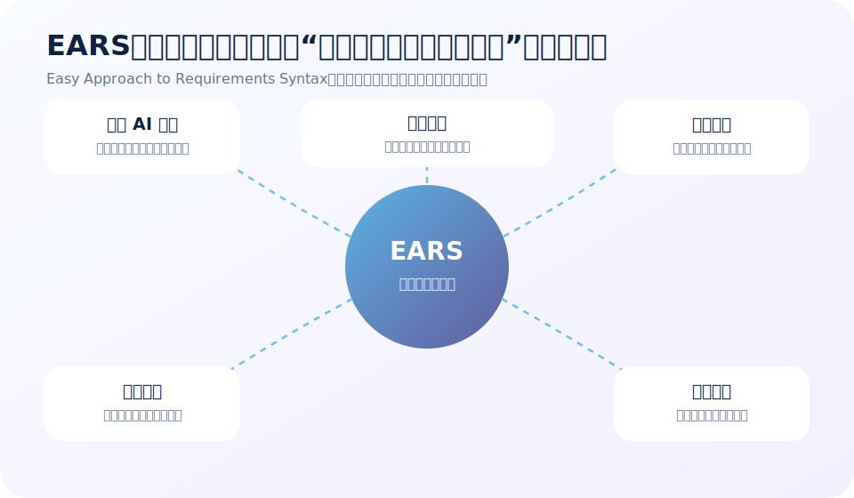
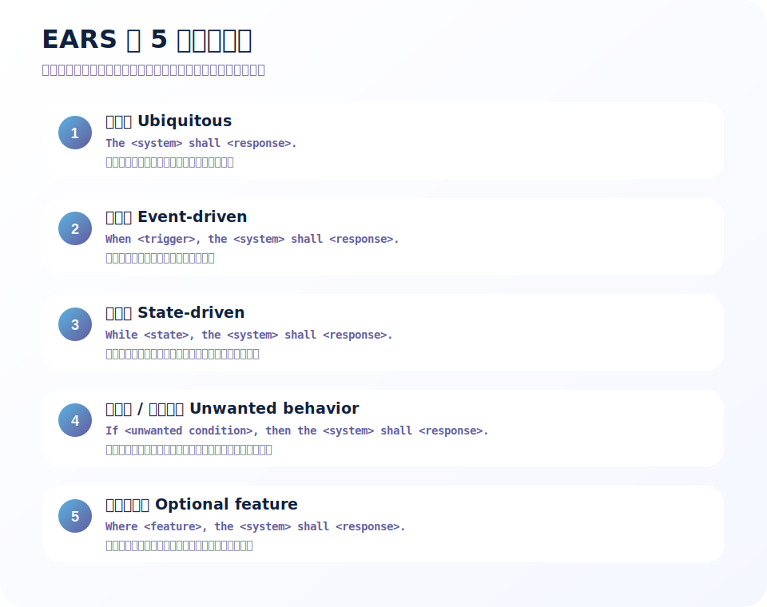
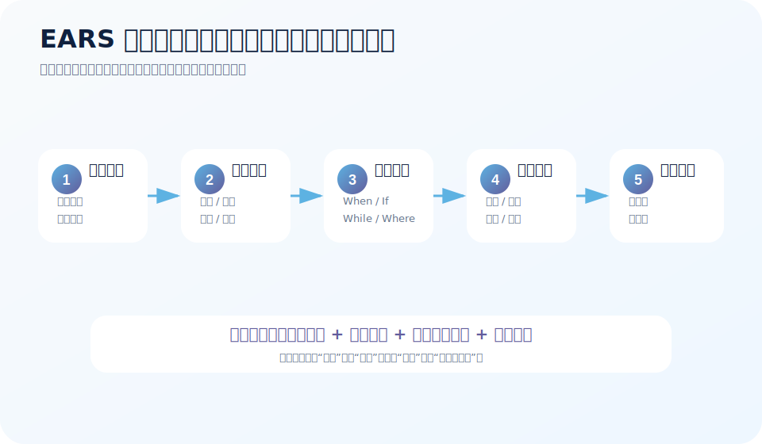
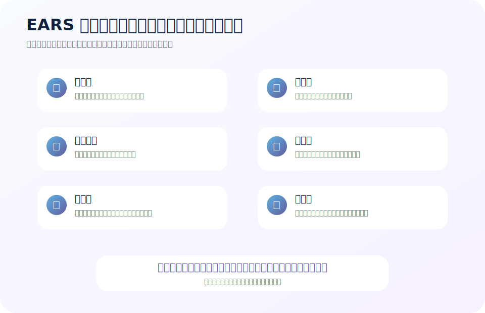

# 采用 EARS 方法进行需求工程标准化：从口头需求到可交付、可验收的需求标准

很多项目的问题，不是开发不会做，也不是测试不认真，而是需求一开始就没有说清楚。

我们经常看到这样的需求：

> “系统要支持用户快速查询订单。”

> “异常时要给用户友好提示。”

> “管理员可以灵活配置审批规则。”

这些话看起来没问题，甚至很像正常需求。

但真正进入开发和测试时，问题马上出现：

- “快速”到底是 1 秒、3 秒，还是用户感觉快就行？
- “异常”包括网络异常、权限异常、数据异常，还是系统异常？
- “友好提示”是谁定义的？提示文案是什么？能不能重试？
- “灵活配置”能配置哪些字段？谁能配置？配置后什么时候生效？

需求不清楚，后面就会变成：

- 产品反复解释
- 开发反复猜
- 测试反复补用例
- 评审会上争论“当时是不是这个意思”
- 上线后发现“业务真正想要的不是这个”

EARS 方法就是为了解决这类问题。



---

## 一句话说清楚：EARS 是什么？

EARS，全称是 **Easy Approach to Requirements Syntax**，可以理解为：

> **一种用固定自然语言句式来写需求的方法。**

它不是一套庞大的需求管理系统，也不是复杂的建模语言。

它的思路很朴素：

> **需求之所以容易含糊，是因为大家随便写。那就给需求几种标准句式，让每个人都按同一套语法写。**

大白话讲：

> EARS 就像给需求写作装了一个“句子模板”。以前大家自由发挥，有人写散文，有人写口号，有人写聊天记录。现在统一要求：什么情况下，哪个系统，必须做什么，结果是什么。

EARS 最常见的价值有四个：

1. **减少歧义**：让需求里的触发条件、状态、响应更明确。
2. **便于评审**：评审时能快速看出缺了条件、异常、边界还是角色。
3. **便于测试**：测试人员能直接从需求推导验收用例。
4. **便于 AI 转化**：结构化句式非常适合大模型批量整理、检查和改写。

---

## 为什么不是所有需求都适合随便写？

自然语言需求最大的问题是：它看起来人人都懂，但每个人理解不一样。

比如：

> “用户登录失败时，系统应提示错误信息。”

这句话看起来很清楚。

但测试会继续问：

- 用户名不存在算登录失败吗？
- 密码错误算登录失败吗？
- 账号锁定算登录失败吗？
- 验证码错误算登录失败吗？
- 网络超时算登录失败吗？
- 错误信息是否要区分原因？
- 为了安全，是否不能提示“用户名不存在”？
- 连续失败多少次要锁定？

所以，问题不是这句话完全错，而是它不够可执行。

EARS 的作用，就是逼我们把这些问题提前说清楚。

它不是让需求变得“文绉绉”。

恰恰相反，它是让需求从“大家感觉差不多”变成“开发和测试都知道怎么做”。

---

## EARS 的核心结构：条件 + 主体 + 必须行为

EARS 需求通常会回答几个问题：

| 问题 | 对应需求要素 | 说明 |
| --- | --- | --- |
| 谁负责？ | 系统主体 | 是系统、模块、页面、接口，还是某个服务？ |
| 什么时候发生？ | 触发条件 | 是用户点击、定时任务、消息到达，还是外部系统调用？ |
| 在什么状态下？ | 状态条件 | 是登录中、审批中、离线中、库存不足中，还是开关开启时？ |
| 出现什么异常？ | 异常条件 | 是非法输入、超时、无权限、数据不存在，还是第三方失败？ |
| 必须做什么？ | 系统响应 | 系统要展示、保存、拒绝、通知、重试、记录、回滚什么？ |
| 如何判断完成？ | 验收结果 | 有没有可观察输出、状态变化、日志、数据或消息？ |

一句合格的 EARS 需求，通常至少要让人看出：

> **在什么条件下，哪个系统，必须产生什么可验证的行为。**

这就是它的核心。

---

## EARS 的 5 类基础句式

EARS 最实用的地方，是它把常见需求分成几类，每类对应一种句式。



下面逐个讲。

---

## 1）普遍型需求：系统一直都应该满足什么？

### 标准句式

```text
The <system> shall <response>.
```

中文可以写成：

```text
<系统>应<执行某行为 / 满足某约束>。
```

### 什么时候用？

当一个需求不依赖特定触发事件、不依赖特定状态，而是系统一直都应该满足时，用普遍型。

适合表达：

- 基础能力
- 全局约束
- 通用规则
- 默认行为
- 持续性要求

### 大白话解释

> 这类需求就是“只要系统存在，就应该一直这样”。不需要等用户点按钮，也不需要等进入某个状态。

### 示例

不标准写法：

> 系统要记录用户操作日志。

EARS 写法：

> **审计模块应记录用户对订单的新增、修改、删除和审批操作。**

更完整一点：

> **审计模块应记录用户对订单的新增、修改、删除和审批操作，并保存操作者、操作时间、操作类型、订单编号和操作结果。**

为什么更好？

因为它说清楚了：

- 主体：审计模块
- 行为：记录操作日志
- 范围：订单新增、修改、删除、审批
- 字段：操作者、时间、类型、编号、结果

### 常见误区

普遍型需求容易写得太大。

比如：

> 系统应保证数据安全。

这不是一个好需求。

它太宽了。

应该拆成：

- 系统应对用户密码进行不可逆加密存储。
- 系统应在用户连续 5 次登录失败后锁定账号 15 分钟。
- 系统应记录管理员导出敏感数据的审计日志。
- 系统应只允许具备“数据导出”权限的用户导出客户清单。

大白话：

> “要安全”是愿望，不是需求。需求必须说清楚安全靠什么实现、如何验证。

---

## 2）事件型需求：某件事发生时，系统要做什么？

### 标准句式

```text
When <trigger>, the <system> shall <response>.
```

中文可以写成：

```text
当<触发事件>时，<系统>应<执行某响应>。
```

### 什么时候用？

当系统行为由某个事件触发时，用事件型。

常见触发事件包括：

- 用户点击按钮
- 用户提交表单
- 外部系统调用接口
- 定时任务到达
- 消息队列收到消息
- 文件上传完成
- 支付回调到达
- 审批节点通过

### 大白话解释

> 事件型需求就是“只要某件事发生，系统就必须有反应”。它最适合描述交互、接口、消息和流程节点。

### 示例：简单需求

原始需求：

> 用户点击保存后要保存数据。

EARS 写法：

> **当用户在订单编辑页点击“保存”按钮时，订单管理系统应校验订单必填字段并保存校验通过的订单数据。**

继续补充验收细节：

> **当用户在订单编辑页点击“保存”按钮且订单必填字段校验通过时，订单管理系统应保存订单数据并展示“保存成功”提示。**

这里已经比原始需求清楚很多。

### 示例：接口需求

原始需求：

> 外部系统可以同步客户信息。

EARS 写法：

> **当客户中心调用客户同步接口并提交合法客户数据时，客户服务应创建或更新对应客户记录，并返回同步结果。**

如果要更可测，可以继续拆：

> **当客户中心调用客户同步接口且客户编号不存在时，客户服务应创建客户记录并返回创建成功结果。**

> **当客户中心调用客户同步接口且客户编号已存在时，客户服务应更新客户记录并返回更新成功结果。**

注意，EARS 经常会把一句模糊需求拆成多句。

这是好事。

---

## 3）状态型需求：在某个状态期间，系统要持续满足什么？

### 标准句式

```text
While <state>, the <system> shall <response>.
```

中文可以写成：

```text
当<系统/对象处于某状态>期间，<系统>应<执行某行为 / 满足某约束>。
```

### 什么时候用？

当需求和某个持续状态有关时，用状态型。

常见状态包括：

- 用户已登录
- 订单待支付
- 工单处理中
- 账号锁定中
- 服务降级中
- 设备离线中
- 审批进行中
- 功能开关关闭中

### 大白话解释

> 事件型是“发生一下就触发”。状态型是“只要还处在这个状态，就一直要遵守”。

### 示例：订单状态

原始需求：

> 待支付订单可以取消。

EARS 写法：

> **当订单处于待支付状态期间，订单管理系统应允许下单用户取消订单。**

还可以补一条反向约束：

> **当订单处于已支付状态期间，订单管理系统不应允许下单用户直接取消订单。**

这两句放在一起，就把状态边界说清楚了。

### 示例：账号锁定状态

原始需求：

> 账号锁定后不能登录。

EARS 写法：

> **当用户账号处于锁定状态期间，认证系统应拒绝该账号的登录请求并展示账号锁定提示。**

再补充解锁：

> **当用户账号锁定时间达到 15 分钟时，认证系统应自动解除该账号的锁定状态。**

第一句是状态型。

第二句是事件型，因为“锁定时间达到 15 分钟”是触发事件。

---

## 4）异常型需求：出现问题时，系统要怎么处理？

### 标准句式

```text
If <unwanted condition>, then the <system> shall <response>.
```

中文可以写成：

```text
如果<异常 / 非期望条件>，则<系统>应<执行某响应>。
```

### 什么时候用？

当出现错误、异常、非法输入、失败、超时、冲突、无权限等情况时，用异常型。

常见异常包括：

- 参数缺失
- 参数格式错误
- 用户无权限
- 数据不存在
- 数据状态不允许操作
- 第三方接口超时
- 消息重复消费
- 库存不足
- 支付失败
- 网络中断

### 大白话解释

> 异常型需求就是“出事的时候怎么办”。很多系统事故不是正常流程没写，而是异常流程没写。

### 示例：参数异常

原始需求：

> 参数错误时要提示。

EARS 写法：

> **如果创建订单请求缺少收货地址，则订单服务应拒绝创建订单并返回“收货地址不能为空”的错误信息。**

更工程化一点：

> **如果创建订单请求缺少收货地址，则订单服务应返回 HTTP 400 状态码、错误码 `ORDER_ADDRESS_REQUIRED` 和错误信息“收货地址不能为空”。**

这就能直接测试。

### 示例：第三方超时

原始需求：

> 支付系统异常时要处理。

EARS 写法：

> **如果支付网关在 5 秒内未返回支付结果，则支付服务应将支付记录标记为“支付确认中”，记录超时日志，并向用户展示“支付结果确认中，请稍后查看”。**

这句话说清楚了：

- 异常条件：5 秒内未返回
- 系统响应：状态改为支付确认中
- 记录：超时日志
- 用户反馈：展示提示

比“要处理”强很多。

---

## 5）可选特性型需求：只有某个功能存在时才成立

### 标准句式

```text
Where <feature>, the <system> shall <response>.
```

中文可以写成：

```text
在<某特性 / 配置 / 模块启用>的情况下，<系统>应<执行某行为>。
```

### 什么时候用？

当需求只在某个可选功能、配置、版本、授权、部署形态存在时成立，用可选特性型。

适合表达：

- 企业版功能
- 插件功能
- 租户开关
- 功能开关
- 地域差异
- 付费模块
- 私有化部署差异

### 大白话解释

> 这类需求就是“如果这个功能被买了、开了、装了，系统才这样做”。否则不能默认所有客户都有。

### 示例：功能开关

原始需求：

> 支持短信通知。

EARS 写法：

> **在租户启用短信通知功能的情况下，通知服务应在订单发货后向订单收件人发送发货短信。**

如果没有这句“在租户启用短信通知功能的情况下”，开发可能默认所有租户都发短信。

那就会带来成本、合规和用户体验问题。

### 示例：企业版功能

> **在客户购买企业版审计模块的情况下，审计服务应支持按操作者、操作类型、资源编号和时间范围查询审计日志。**

这句话明确了功能范围和版本条件。

---

## 复杂需求怎么写？可以组合模板，但不要写成巨句

真实需求经常不是单一类型。

它可能同时包含：

- 状态
- 事件
- 异常
- 权限
- 可选配置
- 性能约束

EARS 允许组合句式。

比如：

```text
While <state>, when <trigger>, the <system> shall <response>.
```

中文：

> 当<对象处于某状态>期间，如果/当<事件发生>，<系统>应<响应>。

但要注意：

> **组合不是为了写更长的句子，而是为了表达必要条件。**

如果一句话太长，就拆。

### 示例：审批流复杂需求

原始需求：

> 审批中可以撤回，但是已经审批通过的不行，撤回后要通知审批人。

拆成 EARS：

> **当报销单处于审批中状态期间，且提交人点击“撤回”按钮时，报销系统应将报销单状态更新为“已撤回”。**

> **当报销单被撤回时，报销系统应向当前审批人发送撤回通知。**

> **当报销单处于已审批通过状态期间，报销系统不应允许提交人撤回报销单。**

> **如果提交人尝试撤回已审批通过的报销单，则报销系统应拒绝撤回请求并展示“已审批通过的报销单不可撤回”。**

这四句比原来一句更长吗？是的。

但它们更清楚，也更容易开发和测试。

---

## EARS 写作的 10 个技巧

### 技巧 1：先判断需求类型，再写句子

不要上来就写。

先问：

- 这是一直成立的规则吗？用普遍型。
- 是某个事件触发吗？用事件型。
- 是某个状态期间有效吗？用状态型。
- 是异常处理吗？用异常型。
- 是某个可选功能下才有效吗？用可选特性型。

### 技巧 2：一个需求只表达一个行为

反例：

> 当用户提交订单时，系统应校验库存、创建订单、扣减库存、发通知、生成发票。

这句话太大。

更好拆成：

- 当用户提交订单时，订单服务应校验订单商品库存。
- 当订单商品库存充足时，订单服务应创建订单记录。
- 当订单创建成功时，库存服务应扣减订单商品库存。
- 当订单创建成功时，通知服务应向用户发送下单成功通知。
- 当用户选择开具发票且订单支付成功时，发票服务应生成电子发票。

大白话：

> 一句话只承诺一件事。承诺太多，就没人说得清到底哪件没做好。

### 技巧 3：避免模糊词

常见模糊词包括：

- 快速
- 及时
- 友好
- 灵活
- 合理
- 适当
- 尽量
- 支持
- 优化
- 完善
- 相关
- 必要时

这些词不是完全不能用，但必须补定义。

反例：

> 系统应快速返回查询结果。

改写：

> **当用户查询最近 30 天订单且订单数量不超过 1000 条时，订单查询服务应在 2 秒内返回查询结果。**

### 技巧 4：不要把实现方案伪装成需求

反例：

> 系统应使用 Redis 缓存订单查询结果。

这可能是设计方案，不一定是需求。

如果业务真正要的是性能，可以写：

> **当用户查询最近 30 天订单且订单数量不超过 1000 条时，订单查询服务应在 2 秒内返回查询结果。**

至于是否用 Redis，是设计决策。

当然，如果架构约束明确要求必须使用 Redis，也可以写成约束需求：

> **订单查询服务应使用公司统一缓存组件存储高频订单查询结果。**

关键是区分：业务需要什么，技术准备怎么实现。

### 技巧 5：异常需求要单独写

很多需求只写 happy path。

比如：

> 用户提交订单后，系统创建订单。

但真正容易出问题的是：

- 库存不足
- 地址为空
- 优惠券失效
- 支付超时
- 重复提交
- 用户无权限

异常不要藏在备注里。

要用 `If ... then ...` 单独写。

### 技巧 6：权限需求不要省略

很多需求默认“用户可以操作”，但没有说哪个用户。

反例：

> 用户可以删除订单。

改写：

> **当订单处于待支付状态期间，订单管理系统应允许订单创建人删除该订单。**

> **如果非订单创建人请求删除订单，则订单管理系统应拒绝删除请求并返回无权限提示。**

### 技巧 7：状态要写清楚

状态是需求歧义重灾区。

例如“订单可以取消”，一定要问：

- 待支付可以吗？
- 已支付可以吗？
- 已发货可以吗？
- 已完成可以吗？
- 已取消还能再取消吗？

状态不清楚，后面一定吵架。

### 技巧 8：数据字段要写清楚

“展示订单信息”不是合格需求。

要写清楚展示哪些字段。

比如：

> **当用户打开订单详情页时，订单管理系统应展示订单编号、订单状态、下单时间、商品名称、商品数量、订单金额、收货地址和支付状态。**

### 技巧 9：质量属性也要 EARS 化

性能、安全、可用性、审计、兼容性都可以写成 EARS。

例如：

> **当用户查询最近 30 天订单且返回结果不超过 1000 条时，订单查询服务应在 2 秒内返回结果。**

> **如果用户连续 5 次输入错误密码，则认证系统应锁定该账号 15 分钟。**

> **当管理员导出客户数据时，审计服务应记录导出人、导出时间、导出条件、导出数量和导出结果。**

### 技巧 10：每条需求都要能推导验收用例

写完需求后，立刻问：

> 测试同学能不能根据这句话写出测试用例？

如果不能，这句话还不合格。

---

## EARS 落地流程：从口头需求到标准需求



推荐流程是：

1. **收集原始需求**：会议纪要、用户故事、PRD、工单、聊天记录。
2. **抽取需求要素**：主体、触发、状态、异常、响应、约束。
3. **判断需求类型**：普遍型、事件型、状态型、异常型、可选特性型。
4. **套用 EARS 句式**：先写草案，不追求一步完美。
5. **补充验收条件**：性能、权限、数据、错误码、文案、日志等。
6. **拆分原子需求**：一句只表达一个行为。
7. **评审质量门**：检查是否明确、可测、必要、一致、完整。
8. **生成验收用例**：把每条需求映射到测试场景。
9. **建立追踪关系**：需求编号、设计、开发任务、测试用例、缺陷。

大白话：

> 先把“想法”变成“句子”，再把“句子”变成“能测的承诺”。

---

## 需求质量门：写成 EARS 以后还要检查什么？

套了 EARS 模板，不代表需求一定合格。

还要过质量门。



### 1）原子性

一条需求只描述一个可独立验证的行为。

如果一句话里有太多“并且”，很可能要拆。

### 2）明确性

需求里不能有没人能解释清楚的词。

尤其要检查：

- 主体是谁
- 触发是什么
- 状态是什么
- 响应是什么
- 输出是什么

### 3）可验证性

测试人员能判断通过或失败。

如果只能靠“感觉不错”，就不是好需求。

### 4）必要性

每条需求都应该能追溯到业务目标、用户价值、风险控制、法规要求或系统约束。

否则就是“看起来不错，但没人知道为什么要做”。

### 5）一致性

不能和其他需求冲突。

比如一条写“用户可取消已支付订单”，另一条写“已支付订单不可取消”，这就必须澄清。

### 6）完整性

正常流程、异常流程、边界条件、权限、状态、数据范围都要覆盖。

完整不等于把所有东西写进一句话，而是该拆的都拆出来。

---

## 简单需求示例：从一句话到 EARS

### 示例 1：登录成功

原始需求：

> 用户登录成功后进入首页。

EARS：

> **当用户提交正确的用户名和密码时，认证系统应创建用户登录会话并跳转到系统首页。**

验收用例：

- 给定用户账号存在且密码正确
- 当用户提交登录表单
- 则系统创建会话
- 且页面跳转到首页

### 示例 2：搜索订单

原始需求：

> 用户可以搜索订单。

EARS：

> **当登录用户在订单列表页输入订单编号并点击“搜索”按钮时，订单管理系统应展示与该订单编号匹配的订单列表。**

补充无结果：

> **如果订单编号没有匹配的订单，则订单管理系统应展示空结果提示“未找到匹配订单”。**

### 示例 3：导出数据

原始需求：

> 支持导出客户数据。

EARS：

> **当具备“客户数据导出”权限的用户在客户列表页点击“导出”按钮时，客户管理系统应按当前筛选条件生成客户数据导出文件。**

补充权限异常：

> **如果不具备“客户数据导出”权限的用户请求导出客户数据，则客户管理系统应拒绝导出请求并展示无权限提示。**

---

## 复杂需求示例：审批流程

原始需求：

> 报销单提交后进入审批，审批人可以通过或驳回，提交人可以撤回，审批通过后不能再改，金额超过 1 万要走二级审批。

这是一段典型复杂需求。

不要硬写成一句。

应该拆。

### EARS 拆解

> **当提交人提交报销单时，报销系统应将报销单状态更新为“审批中”。**

> **当报销单金额小于或等于 10000 元且提交人提交报销单时，报销系统应创建一级审批任务。**

> **当报销单金额大于 10000 元且提交人提交报销单时，报销系统应创建一级审批任务和二级审批任务。**

> **当报销单处于审批中状态期间，当前审批人点击“通过”按钮时，报销系统应记录审批通过意见并推进到下一审批节点。**

> **当报销单处于审批中状态期间，当前审批人点击“驳回”按钮时，报销系统应将报销单状态更新为“已驳回”并通知提交人。**

> **当报销单处于审批中状态期间，提交人点击“撤回”按钮时，报销系统应将报销单状态更新为“已撤回”并通知当前审批人。**

> **当报销单处于审批通过状态期间，报销系统不应允许提交人修改报销单内容。**

> **如果非当前审批人请求审批报销单，则报销系统应拒绝审批请求并展示无权限提示。**

你会发现，复杂需求不是被 EARS 写复杂了。

而是它本来就复杂，只是原来被一句话糊住了。

EARS 的价值是把复杂性摊开。

---

## 非功能需求也可以用 EARS

很多人以为 EARS 只适合功能需求。

其实非功能需求也可以写。

### 性能

> **当用户查询最近 30 天订单且查询结果不超过 1000 条时，订单查询服务应在 2 秒内返回查询结果。**

### 安全

> **如果用户连续 5 次提交错误密码，则认证系统应锁定该用户账号 15 分钟。**

### 审计

> **当管理员导出客户数据时，审计服务应记录导出人、导出时间、导出条件、导出数量和导出结果。**

### 可用性

> **如果短信服务不可用，则通知服务应将短信通知任务标记为“待重试”并在 5 分钟后重试。**

### 兼容性

> **当客户端使用 v1 订单查询接口时，订单服务应继续返回 v1 接口定义中的全部字段。**

非功能需求最怕写成口号。

比如“系统要高性能、高可用、安全可靠”。

这不是需求，是愿望清单。

EARS 会逼你把愿望变成可验证承诺。

---

## 借助大模型把原始需求转成 EARS

EARS 非常适合和大模型结合。

因为它有固定模板，大模型擅长做：

- 信息抽取
- 分类
- 改写
- 补充问题
- 发现歧义
- 生成验收用例

但要记住：

> **大模型可以生成需求草案，但不能替你确认业务事实。**

推荐流程如下：


### 大模型适合做什么？

- 把会议纪要整理成候选需求
- 把用户故事改写成 EARS 句式
- 检查需求是否缺少触发条件、状态、异常、权限
- 生成待澄清问题
- 根据 EARS 需求生成验收用例
- 检查需求之间是否存在冲突
- 生成需求追踪矩阵草案

### 大模型不应该单独决定什么？

- 业务规则到底是什么
- 异常时是否允许放行
- 性能指标是否合理
- 权限边界是否符合组织制度
- 法规和合规要求是否满足
- 是否可以删减某个需求

大白话：

> AI 可以帮你把乱糟糟的需求材料整理成一桌菜，但菜能不能上桌，还得业务、产品、研发和测试确认。

---

## 推荐的大模型转化提示词

可以直接复制使用。

### 需求抽取提示词

```text
你是资深需求工程师。请从以下原始材料中抽取候选需求。

要求：
1. 不要擅自补充材料中没有的信息。
2. 每条需求只表达一个行为。
3. 标注需求类型：普遍型、事件型、状态型、异常型、可选特性型。
4. 对缺失的触发条件、状态、权限、异常、数据范围提出澄清问题。
5. 输出表格：编号、原始描述、需求类型、EARS 草案、待澄清问题。

原始材料：
<<<在这里粘贴会议纪要 / PRD / 用户故事>>>
```

### EARS 改写提示词

```text
请将以下需求改写为 EARS 风格的标准需求。

EARS 模板：
- 普遍型：<系统>应<响应>。
- 事件型：当<触发事件>时，<系统>应<响应>。
- 状态型：当<状态>期间，<系统>应<响应>。
- 异常型：如果<异常条件>，则<系统>应<响应>。
- 可选特性型：在<特性启用>的情况下，<系统>应<响应>。

要求：
1. 一条需求只表达一个可验证行为。
2. 避免“快速、友好、灵活、合理、适当”等模糊词，无法确定时列为待澄清问题。
3. 明确系统主体、触发条件、状态、异常条件、响应结果。
4. 为每条需求生成至少 1 条验收用例。
5. 不要编造业务规则。

待改写需求：
<<<粘贴需求>>>
```

### 质量检查提示词

```text
请审查以下 EARS 需求质量。

检查维度：
1. 是否原子：一条需求是否只表达一个行为？
2. 是否明确：主体、触发、状态、响应是否清楚？
3. 是否可验证：测试人员能否判断通过或失败？
4. 是否必要：是否能看出业务目标或约束来源？
5. 是否一致：是否和其他需求冲突？
6. 是否完整：是否缺少异常、权限、边界、状态、数据范围？

输出：
- 问题清单
- 修改建议
- 改写后的 EARS 版本
- 待业务确认的问题

需求列表：
<<<粘贴 EARS 需求>>>
```

---

## 团队落地建议：不要一上来追求完美

EARS 最怕被当成“文档形式主义”。

如果一开始就要求所有人把所有需求都写得完美，通常会失败。

更好的落地方式是分阶段。

### 第一阶段：只治理高风险需求

先选这些需求使用 EARS：

- 跨团队接口需求
- 状态机复杂需求
- 权限和安全需求
- 异常处理需求
- 涉及资金、审批、合规的需求
- 测试经常争议的需求

不要一上来覆盖所有小需求。

### 第二阶段：建立模板和示例库

团队需要自己的示例库。

比如：

- 登录认证类需求怎么写
- 审批流需求怎么写
- 列表查询需求怎么写
- 导入导出需求怎么写
- 消息通知需求怎么写
- 权限异常需求怎么写

示例比原则更容易让人学会。

### 第三阶段：把 EARS 纳入评审

需求评审时增加几个问题：

- 这条需求属于哪类 EARS？
- 有没有触发条件？
- 有没有状态边界？
- 有没有异常处理？
- 有没有权限约束？
- 测试能不能直接写用例？

### 第四阶段：引入大模型辅助

让大模型做初稿和检查，人做确认。

这样不会增加太多负担。

### 第五阶段：建立追踪矩阵

最终把 EARS 需求和以下对象关联：

- 业务目标
- 设计文档
- 开发任务
- 测试用例
- 缺陷
- 上线验证

这时 EARS 就不只是写法，而是需求工程体系的一部分。

---

## 一页版总结

如果只记住几句话，可以记这些：

1. **EARS 是一种需求句式标准化方法，不是复杂工具。**
2. **它的目标是减少歧义，让需求可开发、可测试、可追踪。**
3. **核心句式有 5 类：普遍型、事件型、状态型、异常型、可选特性型。**
4. **复杂需求不要写成长句，要拆成多条原子需求。**
5. **异常、权限、状态、边界是最容易漏的部分。**
6. **写完 EARS 后还要过质量门：原子、明确、可验证、必要、一致、完整。**
7. **大模型非常适合把原始材料转成 EARS 草案，但业务事实必须由人确认。**
8. **EARS 的最终价值不是让文档好看，而是让团队少返工、少争议、少误解。**

一句大白话收尾：

> **需求不是写给产品自己看的，而是写给开发、测试、业务和未来的自己看的。EARS 的价值，就是让每个人看到同一句需求时，脑子里出现的是同一件事。**

---

## 配套文档

为了方便学习和落地，我把内容拆成三份：

- `ears-requirements-standard-wechat.md`：主文档，讲方法、含义、流程和技巧。
- `ears-examples-library.md`：示例库，覆盖简单需求、复杂需求、异常、权限、非功能需求。
- `ears-llm-conversion-playbook.md`：大模型辅助转化手册，提供提示词、流程、质检清单和实现方案。

---

## 参考说明

本文基于 EARS（Easy Approach to Requirements Syntax）公开方法、需求工程常见实践和大模型辅助需求整理经验编写。EARS 由 Alistair Mavin 等人在需求工程领域提出并推广，核心思想是通过少量自然语言句式降低需求歧义。本文没有照搬特定论文内容，而是面向中文软件研发团队做了工程化解释和实战化改写。
