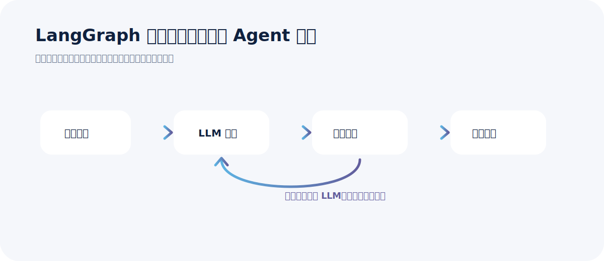
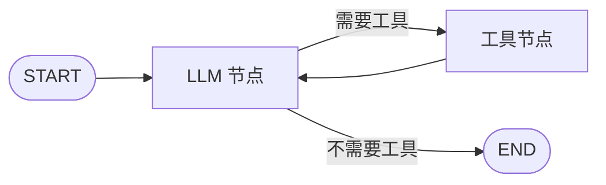

## 为什么第一讲先写“计算器 Agent”

LangGraph 的官方快速入门用的是一个计算器 Agent：模型接收问题，判断是否需要调用 `add`、`multiply`、`divide` 这些工具；如果需要，就进入工具节点；工具执行完以后，结果再回到模型；直到模型不再请求工具调用，图才结束。

这个例子小，但它把 LangGraph 最核心的结构都摆出来了：

- **State**：全流程共享的数据小本子。
- **Node**：真正干活的函数，比如调用模型、调用工具。
- **Edge**：告诉图下一步去哪。
- **Conditional Edge**：根据当前状态判断下一步去哪。
- **Compile**：图必须编译后才能运行。

一句大白话：**LangGraph 不是替你写 Prompt 的库，而是帮你把 Agent 的执行过程变成一张可控、可恢复、可观察的图。**

## 这一组内容建议拆成 4 篇

官方文档从安装、快速入门、本地服务，到 thinking-in-langgraph 和 workflows-agents，信息量比较大。直接塞进一篇会很长，也不利于讲课节奏。建议拆成 4 篇：

1. **安装与快速入门**：先跑通第一个计算器 Agent。
2. **Graph API 与用图思考**：讲 State、Node、Edge、Command、interrupt。
3. **工作流与 Agent 模式**：讲链式、并行、路由、编排、评估优化和 Agent 循环。
4. **本地服务与 Studio 调试**：把 graph 变成 HTTP 服务，并用 Studio 可视化调试。

## 安装 LangGraph

基础安装很简单：

```bash
pip install -U langgraph
```

但真实开发一般还会用到 LangChain 的模型和工具接口：

```bash
pip install -U langchain langchain-openai python-dotenv
```

如果要跑本系列的完整示例，直接使用代码目录中的依赖文件：

```bash
cd /Users/chao/Desktop/分享文档库/output/courses/langgraph/code
pip install -r requirements.txt
```

## 配置模型环境变量

示例默认使用 OpenAI 兼容接口。你可以接 OpenAI，也可以接公司内部网关、国产模型网关或 LiteLLM 网关。

```bash
OPENAI_API_KEY=你的 key
OPENAI_BASE_URL=https://你的模型网关/v1
OPENAI_MODEL=你的模型名
```

大白话解释：**LangGraph 关心的是“节点怎么流转”，不关心你背后用哪家模型。只要 LangChain 的 ChatModel 能调通，就能放进节点里。**

## 快速入门图结构



这个图里最关键的是循环：

- 第一次 LLM 看到问题：可能不知道最终答案，但知道要调用工具。
- Tool Node 执行工具：把真实计算结果写回消息列表。
- LLM 再看工具结果：决定继续调用工具，还是给最终答案。

## 快速入门完整代码

代码已保存到：`output/courses/langgraph/code/01_install_quickstart_calculator.py`。

```python
"""01：安装与快速入门 —— 一个最小计算器 Agent。

运行前：
1. 安装依赖：pip install -r requirements.txt
2. 复制 .env.example 为 .env，填写 OPENAI_API_KEY / OPENAI_BASE_URL / OPENAI_MODEL
3. 执行：python 01_install_quickstart_calculator.py
"""

from __future__ import annotations

import operator
from typing import Annotated, Literal

from langchain.messages import AnyMessage, HumanMessage, SystemMessage, ToolMessage
from langchain.tools import tool
from typing_extensions import TypedDict

from langgraph.graph import END, START, StateGraph

from common import make_model, print_section, save_mermaid


@tool
def multiply(a: int, b: int) -> int:
    """Multiply a and b."""
    return a * b


@tool
def add(a: int, b: int) -> int:
    """Add a and b."""
    return a + b


@tool
def divide(a: int, b: int) -> float:
    """Divide a by b."""
    return a / b


class CalculatorState(TypedDict):
    # Annotated[..., operator.add] 表示新消息追加到旧消息后面。
    messages: Annotated[list[AnyMessage], operator.add]
    llm_calls: int


tools = [add, multiply, divide]
tools_by_name = {t.name: t for t in tools}
model = make_model(temperature=0)
model_with_tools = model.bind_tools(tools)


def llm_call(state: CalculatorState) -> dict:
    """让模型决定：直接回答，还是先调用工具。"""
    response = model_with_tools.invoke(
        [
            SystemMessage(
                content=(
                    "You are a helpful calculator assistant. "
                    "Use tools for arithmetic and keep the final answer concise."
                )
            )
        ]
        + state["messages"]
    )
    return {"messages": [response], "llm_calls": state.get("llm_calls", 0) + 1}


def tool_node(state: CalculatorState) -> dict:
    """执行模型请求的工具调用，并把工具结果写回 messages。"""
    result: list[ToolMessage] = []
    last_message = state["messages"][-1]

    for tool_call in last_message.tool_calls:
        tool_fn = tools_by_name[tool_call["name"]]
        observation = tool_fn.invoke(tool_call["args"])
        result.append(ToolMessage(content=str(observation), tool_call_id=tool_call["id"]))

    return {"messages": result}


def should_continue(state: CalculatorState) -> Literal["tool_node", "__end__"]:
    """如果模型还要调工具，就去工具节点；否则结束。"""
    last_message = state["messages"][-1]
    if getattr(last_message, "tool_calls", None):
        return "tool_node"
    return END


def build_graph():
    builder = StateGraph(CalculatorState)
    builder.add_node("llm_call", llm_call)
    builder.add_node("tool_node", tool_node)

    builder.add_edge(START, "llm_call")
    builder.add_conditional_edges("llm_call", should_continue, ["tool_node", END])
    builder.add_edge("tool_node", "llm_call")

    return builder.compile()


def main() -> None:
    graph = build_graph()
    mermaid_path = save_mermaid(graph, "01_calculator_agent.mmd")

    print_section("图结构已保存")
    print(mermaid_path)

    result = graph.invoke(
        {
            "messages": [HumanMessage(content="先计算 7 乘以 8，再把结果加 6，最后除以 2。")],
            "llm_calls": 0,
        }
    )

    print_section("完整消息轨迹")
    for message in result["messages"]:
        message.pretty_print()

    print_section("LLM 调用次数")
    print(result["llm_calls"])


if __name__ == "__main__":
    main()
```

## 代码怎么理解

### State：不是全局变量，而是图的“状态快照”

```python
class CalculatorState(TypedDict):
    messages: Annotated[list[AnyMessage], operator.add]
    llm_calls: int
```

这里的 `messages` 用了 reducer：`operator.add`。意思是每个节点返回的新消息会追加到旧消息后面。否则默认行为是覆盖，聊天历史就只剩最后一次更新了。

### Node：就是普通 Python 函数

`llm_call` 是模型节点，`tool_node` 是工具节点。LangGraph 不要求节点一定是 LLM；节点可以是查询数据库、调用接口、读文件、发消息，也可以只是一个普通 `if` 判断。

### Edge：固定边和条件边

```python
builder.add_edge(START, "llm_call")
builder.add_conditional_edges("llm_call", should_continue, ["tool_node", END])
builder.add_edge("tool_node", "llm_call")
```

大白话：

- `START -> llm_call`：用户输入进来后先问模型。
- `llm_call -> tool_node 或 END`：模型要工具就去工具节点，不要工具就结束。
- `tool_node -> llm_call`：工具执行完，结果要回给模型继续判断。

## 第一讲要记住的 5 句话

1. **LangGraph 的核心是图，不是 Prompt。**
2. **State 是节点之间传递信息的唯一可靠方式。**
3. **Node 是函数，Edge 是路由。**
4. **工具调用不是魔法，本质是模型提出工具请求，代码执行工具，再把结果交回模型。**
5. **图必须 compile 后才能运行。**

## 下一篇讲什么

下一篇会进入 Graph API 和 thinking-in-langgraph：如何把一个客服邮件 Agent 从业务流程拆成节点，什么时候用普通边，什么时候用 `Command`，什么时候必须引入 `interrupt` 和 checkpointer。
