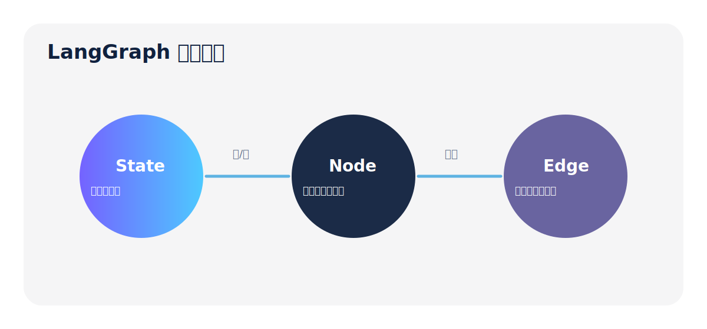
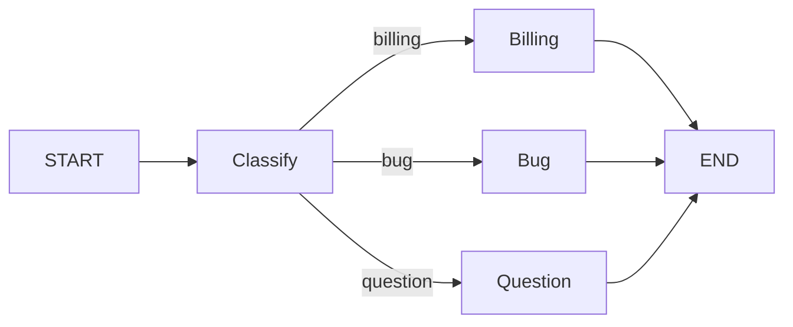
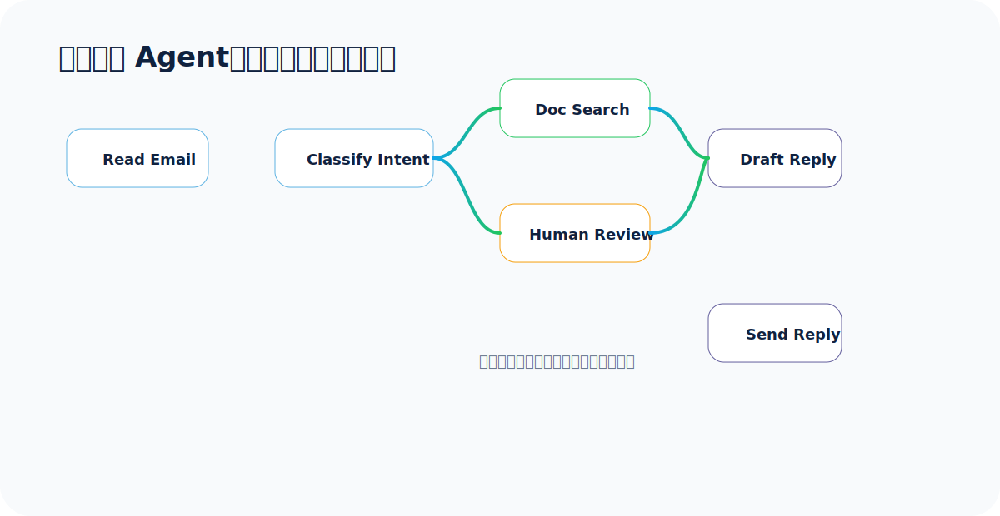
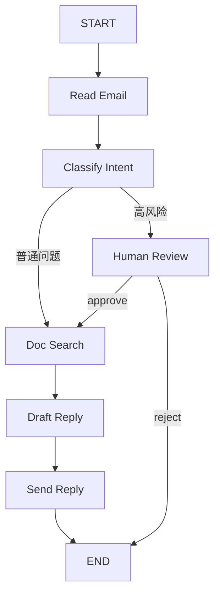

## 从“写一段 Agent 代码”到“设计一张执行图”

很多人第一次写 Agent，会把所有逻辑塞进一个函数里：分类、检索、调用工具、人工审批、发送消息，全在一起。短 Demo 可以跑，真实业务很快会变成一团毛线。

LangGraph 的思路是反过来的：

> 先把流程拆成离散步骤，再用状态把步骤串起来，最后用边定义执行方向。

官方 `thinking-in-langgraph` 用客服邮件 Agent 讲这个过程：读邮件、分类、查文档、创建 bug、人工审核、草拟回复、发送回复。它不是让我们记某个 API，而是训练一种思考方式。

## Graph API 的三个基础概念

### 1. State：流程的共享小本子

State 保存每个节点都可能需要的数据。它不是“所有变量都往里塞”，而是保存跨步骤需要复用、恢复、审计的数据。

应该放进 State 的内容：

- 原始输入，比如用户邮件、消息、工单内容。
- 分类结果、检索结果、工具返回结果。
- 草稿、最终回答、审批结果。
- 需要跨节点保留的执行元数据。

不建议放进 State 的内容：

- 可以随时从其他字段推导出来的临时字符串。
- Prompt 模板。
- 不可序列化对象，比如打开的文件句柄、数据库连接、函数对象。

大白话：**State 存事实，不存“临时拼出来的话”。Prompt 在节点里按需组装。**

### 2. Node：真正干活的函数

节点可以是：

- LLM 调用。
- 数据库查询。
- 向量检索。
- 普通 Python 规则。
- API 调用。
- 人工审核暂停点。

节点输入当前 State，输出 State 的局部更新。节点不需要返回完整 State，只返回它修改的部分即可。

### 3. Edge：决定下一步去哪

边分两类：

- 固定边：A 永远执行完去 B。
- 条件边：A 执行完以后，由路由函数根据 State 判断去 B、C 或 END。



## 第一个 Graph API 示例：工单分类路由

完整代码已保存到：`output/courses/langgraph/code/02_graph_api_state_edges.py`。

```python
from __future__ import annotations

import operator
from typing import Annotated, Literal

from typing_extensions import TypedDict
from langgraph.graph import END, START, StateGraph


class TicketState(TypedDict):
    ticket: str
    category: str
    steps: Annotated[list[str], operator.add]
    answer: str


def classify_ticket(state: TicketState) -> dict:
    text = state["ticket"].lower()
    if any(word in text for word in ["charged", "invoice", "billing", "refund", "付款", "扣费"]):
        category = "billing"
    elif any(word in text for word in ["crash", "bug", "error", "报错", "崩溃"]):
        category = "bug"
    else:
        category = "question"
    return {"category": category, "steps": [f"分类为：{category}"]}


def route_by_category(state: TicketState) -> Literal["billing_node", "bug_node", "question_node"]:
    if state["category"] == "billing":
        return "billing_node"
    if state["category"] == "bug":
        return "bug_node"
    return "question_node"


def billing_node(state: TicketState) -> dict:
    return {"steps": ["进入账单处理流程"], "answer": "我会先核对账单记录，并为你创建退款/复核工单。"}


def bug_node(state: TicketState) -> dict:
    return {"steps": ["进入缺陷处理流程"], "answer": "我会收集复现步骤、环境信息，并同步给研发排查。"}


def question_node(state: TicketState) -> dict:
    return {"steps": ["进入普通问答流程"], "answer": "我会从知识库检索相关说明，并整理成简短回复。"}


def build_graph():
    builder = StateGraph(TicketState)
    builder.add_node("classify_ticket", classify_ticket)
    builder.add_node("billing_node", billing_node)
    builder.add_node("bug_node", bug_node)
    builder.add_node("question_node", question_node)

    builder.add_edge(START, "classify_ticket")
    builder.add_conditional_edges("classify_ticket", route_by_category)
    builder.add_edge("billing_node", END)
    builder.add_edge("bug_node", END)
    builder.add_edge("question_node", END)
    return builder.compile()
```

这个例子里，`steps` 使用了 `operator.add`。多个节点写入 `steps` 时，不会互相覆盖，而是把轨迹追加起来。它特别适合记录执行路径。

## 什么时候用 Command

条件边适合“只路由，不更新状态”。但有时我们希望一个节点既更新 State，又决定下一步。这时用 `Command` 更自然。

```python
from langgraph.types import Command

return Command(
    update={"classification": classification},
    goto="human_review"
)
```

大白话：**条件边像路牌，只负责指路；Command 像边走边记笔记，既能写状态，也能指定下一站。**

## 客服邮件 Agent 的流程图



这个 Agent 的关键点不是“能不能自动回复”，而是“哪些地方不能自动”。比如账单、退款、线上事故、法律风险，都应该先让人确认。



## interrupt：让图暂停，等人回来

`interrupt()` 是 LangGraph 的 Human-in-the-loop 关键能力。它会暂停当前图，把一个 JSON 可序列化的 payload 返回给调用方。人类给出反馈后，用 `Command(resume=...)` 恢复。

```python
review = interrupt({
    "question": "这封邮件是否允许 Agent 继续处理？",
    "classification": state["classification"],
    "email": state["email_content"],
})
```

注意 3 个坑：

1. **interrupt 需要 checkpointer**：否则暂停后不知道从哪里恢复。
2. **恢复必须使用同一个 thread_id**：它就是这次执行的存档编号。
3. **interrupt 前不要放非幂等副作用**：节点恢复时会从节点开头重新执行，可能导致重复写库、重复发邮件。

## 客服邮件 Agent 核心代码

完整代码已保存到：`output/courses/langgraph/code/03_thinking_email_agent.py`。

```python
from typing import Literal, TypedDict

from langgraph.checkpoint.memory import InMemorySaver
from langgraph.graph import END, START, StateGraph
from langgraph.types import Command, interrupt


class EmailClassification(TypedDict):
    intent: Literal["question", "bug", "billing", "feature", "complex"]
    urgency: Literal["low", "medium", "high", "critical"]
    topic: str
    summary: str


class EmailAgentState(TypedDict):
    email_content: str
    sender_email: str
    email_id: str
    classification: EmailClassification | None
    search_results: list[str]
    draft_response: str
    approved: bool | None
    final_response: str


def classify_intent(state: EmailAgentState) -> Command[Literal["search_documentation", "human_review"]]:
    content = state["email_content"].lower()
    if "charged" in content or "扣费" in content or "billing" in content:
        classification = {
            "intent": "billing",
            "urgency": "critical",
            "topic": "账单异常",
            "summary": "用户反馈疑似重复扣费，需要人工确认。",
        }
    else:
        classification = {
            "intent": "question",
            "urgency": "low",
            "topic": "普通问题",
            "summary": "用户提出产品使用问题，可先检索文档。",
        }

    goto = "human_review" if classification["urgency"] in {"high", "critical"} else "search_documentation"
    return Command(update={"classification": classification}, goto=goto)


def human_review(state: EmailAgentState) -> Command[Literal["search_documentation", "send_reply", "__end__"]]:
    review = interrupt({
        "question": "这封邮件是否允许 Agent 继续处理？",
        "classification": state["classification"],
        "email": state["email_content"],
        "expected_input": "approve / reject / send_now",
    })

    if review == "reject":
        return Command(update={"approved": False, "final_response": "已转人工处理。"}, goto=END)
    if review == "send_now":
        return Command(update={"approved": True, "draft_response": "已确认，客服会优先处理该账单问题。"}, goto="send_reply")
    return Command(update={"approved": True}, goto="search_documentation")


def build_graph():
    builder = StateGraph(EmailAgentState)
    builder.add_node("read_email", lambda state: {})
    builder.add_node("classify_intent", classify_intent)
    builder.add_node("search_documentation", lambda state: {"search_results": ["知识库命中：账单异常处理说明"]})
    builder.add_node("draft_response", lambda state: {"draft_response": "你好，我们已收到你的反馈，会继续跟进。"})
    builder.add_node("human_review", human_review)
    builder.add_node("send_reply", lambda state: {"final_response": state["draft_response"]})

    builder.add_edge(START, "read_email")
    builder.add_edge("read_email", "classify_intent")
    builder.add_edge("search_documentation", "draft_response")
    builder.add_edge("draft_response", "send_reply")
    builder.add_edge("send_reply", END)
    return builder.compile(checkpointer=InMemorySaver())
```

## 第二讲小结

这一讲最重要的是：**不要一上来就写 Agent，先画流程。**

- 稳定路径用固定边。
- 分支路径用条件边。
- 同时更新状态和路由，用 `Command`。
- 高风险动作前，用 `interrupt` 让人介入。
- 需要暂停和恢复，就必须配 checkpointer 和 thread_id。
