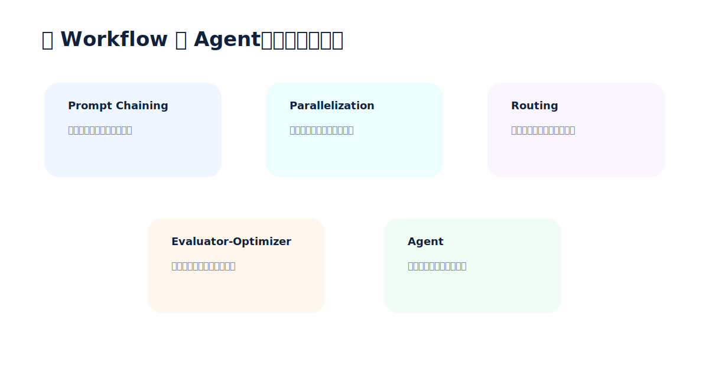
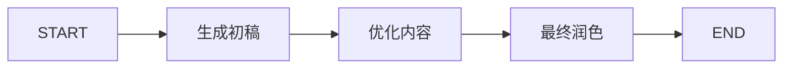
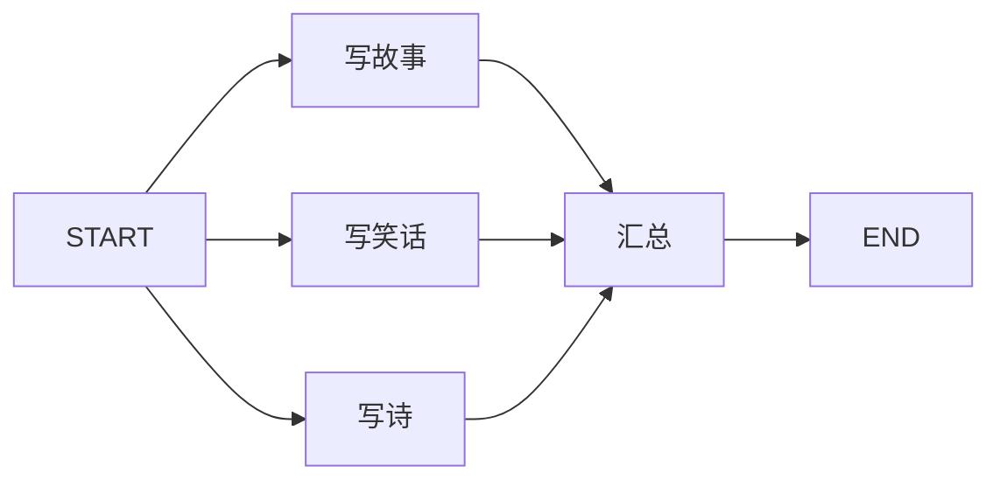
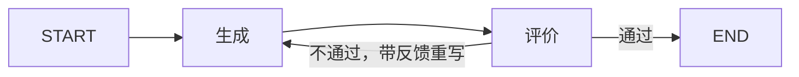
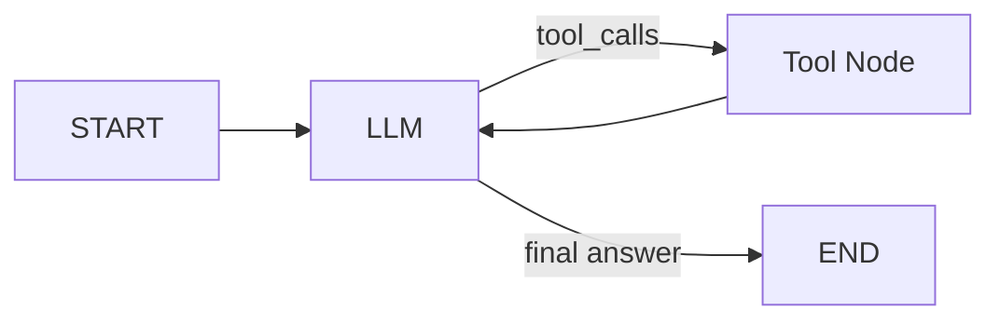

## Workflow 和 Agent 的区别

官方 `workflows-agents` 文档里有一个很实用的区分：

- **Workflow**：路径相对固定，开发者预先设计好执行顺序。
- **Agent**：路径更动态，模型会根据上下文决定调用哪些工具、走几轮、何时结束。

大白话：**Workflow 像流水线，Agent 像带工具箱的实习生。流水线稳定，实习生灵活，但也更需要边界。**

## 模式一：Prompt Chaining

适合任务能拆成连续步骤的场景，比如：

- 先生成初稿，再优化，再润色。
- 先翻译，再校对，再格式化。
- 先抽取信息，再生成摘要。



优点是稳定、容易调试。缺点是路径固定，前一步失败会影响后面。

## 模式二：Parallelization

适合多个子任务互不依赖，可以同时执行的场景：

- 同时抽取关键词、摘要、风险点。
- 同时从多个数据源查询。
- 同时让多个模型给出候选答案，再汇总。



大白话：能并行就别排队，尤其是 I/O 或 LLM 调用比较慢的时候。

## 模式三：Routing

适合先判断类型，再走专门流程的场景：

- 客服问题按账单、Bug、普通问题分类。
- 文档处理按合同、简历、报告走不同抽取逻辑。
- 用户请求按写作、检索、计算走不同工具。

路由的核心是：**先让一个节点做判断，后面交给专业路径。**

## 模式四：Orchestrator-Worker

适合子任务数量事先不确定的场景。比如“写一篇报告”，编排器先拆出章节，再把每个章节分给 Worker 并行生成。

官方文档里强调了 `Send` API：它允许在运行时动态创建多个 Worker 输入。

```python
from langgraph.types import Send

return [Send("write_section", {"section": s}) for s in state["sections"]]
```

大白话：**Parallelization 是固定三个任务并行；Orchestrator-Worker 是先看情况，再动态拆出 N 个任务。**

## 模式五：Evaluator-Optimizer

适合有明确质量标准，但一次生成不一定达标的场景：

- 翻译要保留原意。
- 代码要通过测试。
- 文案要符合品牌语气。
- 答案必须引用来源。



这个模式很强，但要小心无限循环。实际项目里建议加最大轮数或递归限制。

## Agent：让模型决定行动

Agent 通常是一个循环：

1. 模型读取消息和上下文。
2. 模型决定是否调用工具。
3. 工具执行并返回结果。
4. 模型继续判断。
5. 直到模型给出最终答案。



Agent 适合问题和路径都不确定的场景，但不要把所有事情都交给它。高风险工具要加人工审批、权限控制、审计日志和超时机制。

## 示例代码：三种模式一起跑

完整代码已保存到：`output/courses/langgraph/code/04_workflows_agents_patterns.py`。

```python
from __future__ import annotations

from typing import Literal, TypedDict
from langgraph.graph import END, START, StateGraph


class ChainState(TypedDict):
    topic: str
    draft: str
    improved: str
    final: str


def write_draft(state: ChainState) -> dict:
    return {"draft": f"关于 {state['topic']} 的第一版说明：先解释概念，再给例子。"}


def improve_draft(state: ChainState) -> dict:
    return {"improved": state["draft"] + " 补充一句：复杂流程要画成图。"}


def polish_draft(state: ChainState) -> dict:
    return {"final": state["improved"] + " 最后用检查清单收尾。"}


def build_prompt_chain():
    builder = StateGraph(ChainState)
    builder.add_node("write_draft", write_draft)
    builder.add_node("improve_draft", improve_draft)
    builder.add_node("polish_draft", polish_draft)
    builder.add_edge(START, "write_draft")
    builder.add_edge("write_draft", "improve_draft")
    builder.add_edge("improve_draft", "polish_draft")
    builder.add_edge("polish_draft", END)
    return builder.compile()


class ParallelState(TypedDict):
    topic: str
    joke: str
    story: str
    poem: str
    combined: str


def write_joke(state: ParallelState) -> dict:
    return {"joke": f"一个关于 {state['topic']} 的小笑话。"}


def write_story(state: ParallelState) -> dict:
    return {"story": f"一个关于 {state['topic']} 的短故事。"}


def write_poem(state: ParallelState) -> dict:
    return {"poem": f"一首关于 {state['topic']} 的小诗。"}


def aggregate(state: ParallelState) -> dict:
    return {"combined": f"故事：{state['story']}\n笑话：{state['joke']}\n诗：{state['poem']}"}


def build_parallel():
    builder = StateGraph(ParallelState)
    builder.add_node("write_joke", write_joke)
    builder.add_node("write_story", write_story)
    builder.add_node("write_poem", write_poem)
    builder.add_node("aggregate", aggregate)
    builder.add_edge(START, "write_joke")
    builder.add_edge(START, "write_story")
    builder.add_edge(START, "write_poem")
    builder.add_edge("write_joke", "aggregate")
    builder.add_edge("write_story", "aggregate")
    builder.add_edge("write_poem", "aggregate")
    builder.add_edge("aggregate", END)
    return builder.compile()


class EvalState(TypedDict):
    topic: str
    attempt: int
    draft: str
    feedback: str


def generate_answer(state: EvalState) -> dict:
    attempt = state.get("attempt", 0) + 1
    if attempt == 1:
        draft = f"{state['topic']} 很重要。"
    else:
        draft = f"{state['topic']} 很重要，因为它把状态、节点和边组合成可恢复的执行流。"
    return {"attempt": attempt, "draft": draft}


def evaluate_answer(state: EvalState) -> dict:
    if "因为" in state["draft"]:
        return {"feedback": "accepted"}
    return {"feedback": "too vague"}


def route_eval(state: EvalState) -> Literal["generate_answer", "__end__"]:
    if state["feedback"] == "accepted":
        return END
    return "generate_answer"


def build_evaluator_optimizer():
    builder = StateGraph(EvalState)
    builder.add_node("generate_answer", generate_answer)
    builder.add_node("evaluate_answer", evaluate_answer)
    builder.add_edge(START, "generate_answer")
    builder.add_edge("generate_answer", "evaluate_answer")
    builder.add_conditional_edges("evaluate_answer", route_eval, ["generate_answer", END])
    return builder.compile()
```

## 怎么选模式

| 场景 | 推荐模式 | 原因 |
|---|---|---|
| 步骤固定，前后依赖明显 | Prompt Chaining | 简单、稳定、易排查 |
| 多个子任务互不依赖 | Parallelization | 降低整体等待时间 |
| 输入类型差异大 | Routing | 专门路径处理专门问题 |
| 子任务数量运行时才知道 | Orchestrator-Worker | 动态拆分、动态并发 |
| 需要反复打磨质量 | Evaluator-Optimizer | 生成-反馈-重写闭环 |
| 路径不可预测，需要工具探索 | Agent | 灵活，但要加边界 |

## 第三讲小结

LangGraph 的强项不是“把所有东西都做成 Agent”，而是允许你在同一个系统里混合使用不同形状：

- 稳定部分做 Workflow。
- 动态部分做 Agent。
- 高风险部分加 interrupt。
- 长流程加 persistence。
- 需要实时体验时加 streaming。

这才是生产级 Agent 系统更稳的做法。
