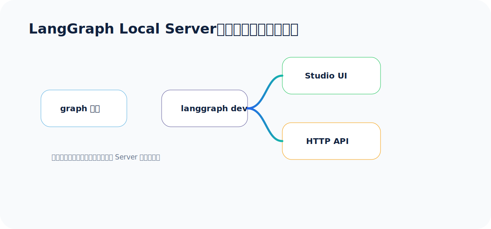
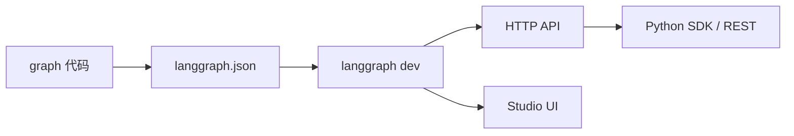

## 为什么要跑 Local Server

前面几讲我们都是用 Python 脚本直接运行 graph。这适合学习，但真实项目还需要：

- 用 HTTP API 调用 Agent。
- 用 Studio 可视化调试节点、状态、路径。
- 本地模拟部署环境。
- 检查流式输出、线程状态、断点和中断。

官方 `local-server` 文档讲的就是这件事：用 `langgraph dev` 把本地 graph 启成 Agent Server。

大白话：**Local Server 不是另一套 Agent 写法，它只是把你已经写好的 graph 包成一个本地服务。**

## 本地服务基本流程



官方步骤可以概括为：

1. 安装 CLI：`pip install -U "langgraph-cli[inmem]"`
2. 准备 LangGraph 应用。
3. 安装应用依赖：`pip install -e .`
4. 创建 `.env` 并填写 key。
5. 启动：`langgraph dev`
6. 打开 Studio 或调用 API 测试。

## 本系列代码目录

```text
code/local_server_demo/
├── .env.example
├── langgraph.json
├── pyproject.toml
└── src/
    └── agent.py
```

## langgraph.json

`langgraph.json` 告诉 CLI：哪个 Python 对象是 graph。

```json
{
  "dependencies": ["."],
  "graphs": {
    "agent": "src.agent:graph"
  },
  "env": ".env"
}
```

这里的 `agent` 是 assistant 名称。后面 SDK 调用时也会用到它。

## pyproject.toml

```toml
[project]
name = "langgraph-local-server-demo"
version = "0.1.0"
description = "A minimal LangGraph local server demo for the course"
requires-python = ">=3.11"
dependencies = [
    "langgraph>=1.0.0",
    "langchain>=1.0.0",
    "langchain-openai>=1.0.0",
    "python-dotenv>=1.0.1",
]

[tool.setuptools.packages.find]
where = ["src"]
```

## agent.py 完整代码

代码已保存到：`output/courses/langgraph/code/local_server_demo/src/agent.py`。

```python
from __future__ import annotations

import os
from typing import Annotated

from dotenv import load_dotenv
from langchain.messages import AnyMessage, SystemMessage
from langchain_openai import ChatOpenAI
from langgraph.graph import END, START, StateGraph
from langgraph.graph.message import add_messages
from typing_extensions import TypedDict

load_dotenv()


class State(TypedDict):
    # add_messages 比 operator.add 更适合聊天：它能按消息 ID 更新已有消息。
    messages: Annotated[list[AnyMessage], add_messages]


def make_model() -> ChatOpenAI:
    api_key = os.getenv("OPENAI_API_KEY")
    if not api_key:
        raise RuntimeError("请在 local_server_demo/.env 中填写 OPENAI_API_KEY")

    return ChatOpenAI(
        model=os.getenv("OPENAI_MODEL", "gpt-4o-mini"),
        api_key=api_key,
        base_url=os.getenv("OPENAI_BASE_URL") or None,
        temperature=0,
    )


def call_model(state: State) -> dict:
    """本地服务暴露的单节点 Agent。"""
    model = make_model()
    response = model.invoke(
        [SystemMessage(content="你是一个简洁、准确的 LangGraph 助教。")]
        + state["messages"]
    )
    return {"messages": [response]}


builder = StateGraph(State)
builder.add_node("call_model", call_model)
builder.add_edge(START, "call_model")
builder.add_edge("call_model", END)

graph = builder.compile()
```

## 启动本地服务

进入目录：

```bash
cd /Users/chao/Desktop/分享文档库/output/courses/langgraph/code/local_server_demo
cp .env.example .env
pip install -e .
langgraph dev
```

启动成功后，一般会看到：

```text
API: http://127.0.0.1:2024
Studio UI: https://smith.langchain.com/studio/?baseUrl=http://127.0.0.1:2024
API Docs: http://127.0.0.1:2024/docs
```

## 用 Python SDK 测试服务

完整测试代码已保存到：`output/courses/langgraph/code/05_test_local_server_client.py`。

```python
from __future__ import annotations

import asyncio
import os

from dotenv import load_dotenv
from langgraph_sdk import get_client

load_dotenv()


async def main() -> None:
    url = os.getenv("LANGGRAPH_SERVER_URL", "http://127.0.0.1:2024")
    client = get_client(url=url)

    async for chunk in client.runs.stream(
        None,
        "agent",
        input={"messages": [{"role": "human", "content": "请用一句话解释 LangGraph。"}]},
    ):
        print(f"event={chunk.event}")
        print(chunk.data)
        print("-" * 60)


if __name__ == "__main__":
    asyncio.run(main())
```

## Studio 适合看什么

Studio 不是“好看的外壳”，它主要帮你看清这些问题：

- 当前执行到了哪个节点。
- 每一步 State 怎么变化。
- 哪条条件边被选中。
- 哪个节点耗时最长。
- interrupt 暂停时等待什么输入。
- 工具调用和模型输出是否符合预期。

对于多节点 Agent，Studio 的价值很高。否则你只能靠日志猜图里面发生了什么，很像摸黑找数据线。

## 和 persistence / streaming 的关系

Local Server 常常和这两个能力一起使用：

### Persistence

Persistence 会把 graph state 存成 checkpoint。它支持：

- 多轮对话记忆。
- human-in-the-loop 暂停和恢复。
- time travel 调试。
- 失败后从上一个成功步骤恢复。

### Streaming

Streaming 用于实时返回执行过程。常见 stream mode：

| 模式 | 用途 |
|---|---|
| updates | 每个节点返回了哪些状态更新 |
| values | 每一步后的完整状态 |
| messages | LLM token 级流式输出 |
| custom | 节点里主动发出的自定义事件 |
| checkpoints | checkpoint 事件 |
| tasks | task 开始、结束、错误事件 |
| debug | 尽可能多的调试信息 |

新版本建议关注 `version="v2"` 的统一格式：每个 chunk 都有 `type`、`ns`、`data`。

## 第四讲小结

到这里，这组 LangGraph 入门材料就闭环了：

1. 第一讲跑通最小 Agent。
2. 第二讲掌握 Graph API 和 human-in-the-loop。
3. 第三讲知道常见 workflow / agent 模式怎么选。
4. 第四讲把 graph 启成本地服务，并用 Studio 和 SDK 调试。

真正上项目时，可以按这个顺序落地：先画流程，再写节点，再加状态，再加持久化和人工审批，最后接服务和观测。
